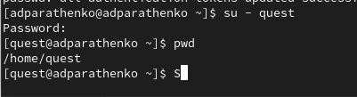
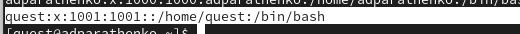
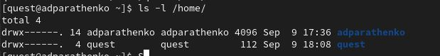
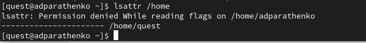
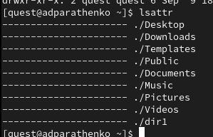
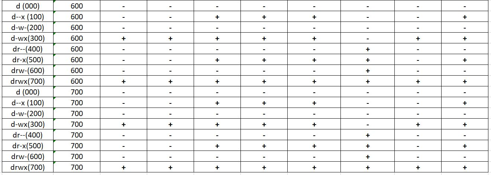
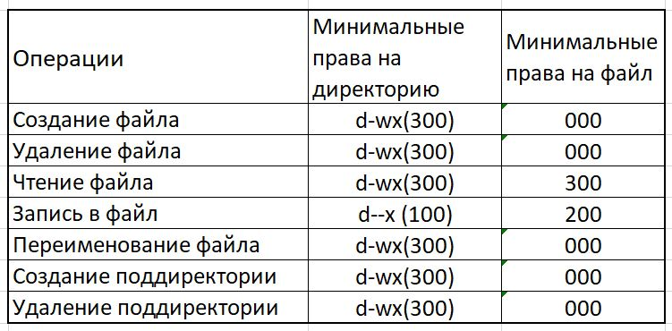

---
## Front matter
lang: ru-RU
title: Structural approach to the deep learning method
author: |
	Leonid A. Sevastianov\inst{1,3}
	\and
	Anton L. Sevastianov\inst{1}
	\and
	Edik A. Ayrjan\inst{2}
	\and
	Anna V. Korolkova\inst{1}
	\and
	Dmitry S. Kulyabov\inst{1,2}
	\and
	Imrikh Pokorny\inst{4}
institute: |
	\inst{1}RUDN University, Moscow, Russian Federation
	\and
	\inst{2}LIT JINR, Dubna, Russian Federation
	\and
	\inst{3}BLTP JINR, Dubna, Russian Federation
	\and
	\inst{4}Technical University of Košice, Košice, Slovakia
date: NEC--2019, 30 September -- 4 October, 2019 Budva, Montenegro

## Formatting
toc: false
slide_level: 2
theme: metropolis
header-includes: 
 - \metroset{progressbar=frametitle,sectionpage=progressbar,numbering=fraction}
 - '\makeatletter'
 - '\beamer@ignorenonframefalse'
 - '\makeatother'
aspectratio: 43
section-titles: true
---
# Цель работы

Получение практических навыков работы в консоли с атрибутами файлов, закрепление теоретических основ дискреционного разграничения доступа в современных системах с открытым кодом на базе ОС Linux.

# Ход лабораторной работы
## Задание 1

#### №1
В установленной при выполнении предыдущей лабораторной работы
операционной системе создаём учётную запись пользователя guest (использую учётную запись администратора)с помощью команды:
***useradd quest***
#### №2
Задаём пароль для пользователя guest с помощью команды:
***passwd quest***
(рис. [-@fig:001])

#### №3
Входим в систему от имени пользователя guest с помощью команды:
***su - quest***
#### №4
Определяем директорию, в которой находимся, с помощью команды:
***pwd***
(рис. [-@fig:002])

#### №5
Уточняем имя нашего пользователя с помощью команды:
***whoami***
(рис. [-@fig:003])

#### №6
Уточняем имя пользователя, его группу, а также группы, куда входит пользователь с помощью команды:
***id***
Выведенные значения uid, gid и др. запоминаем. Сравнив вывод id с выводом команды groups, видим, что всё совпадает.
(рис. [-@fig:004])

#### №7
Сравниваем полученную информацию об имени пользователя с данными,
выводимыми в приглашении командной строки.

#### №8
Просмотрите файл /etc/passwd командой
***cat /etc/passwd***
Найдите в нём свою учётную запись. Определите uid пользователя.
Определите gid пользователя. Сравните найденные значения с полученными в предыдущих пунктах.

(рис. [-@fig:005]) - (рис. [-@fig:006])

#### №9
Определите существующие в системе директории командой
***ls -l /home/***
Найдите в нём свою учётную запись. Определите uid пользователя.
Определите gid пользователя. Сравните найденные значения с полученными в предыдущих пунктах.

(рис. [-@fig:007])

Список поддиректорий директории /home получить удалось. На директориях установлены права чтения, записи и выполнения для самого пользователя
(для группы и остальных пользователей никаких прав доступа не установлено.

#### №10
Проверьте, какие расширенные атрибуты установлены на поддиректориях, находящихся в директории /home, командой:
***lsattr /home***

(рис. [-@fig:008])

Удалось увидеть расширенные атрибуты только директории того пользователя, от имени которого я нахожусь в системе

#### №11
Создайте в домашней директории поддиректорию dir1 командой:
***mkdir dir1***
Определите командами ls -l и lsattr, какие права доступа и расширенные атрибуты были выставлены на директорию dir1.

(рис. [-@fig:009]) - (рис. [-@fig:011])

#### №12
Снимите с директории dir1 все атрибуты командой:
***chmod 000 dir1***
Определите командами ls -l и lsattr, какие права доступа и расширенные атрибуты были выставлены на директорию dir1.

(рис. [-@fig:012])

#### №13
Попыталась создать в директории dir1 файл file1 командой echo “test” >
/home/guest/dir1/file1. Этого сделать не получилось, т.к. предыдущим
действием мы убрали право доступа на запись в директории.

## Задание 2
#### №1
Заполните таблицу **«Установленные права и разрешённые действия»**.
*Создание файла: “echo”text” > dir1/file1”
Удаление файла: “rm -r dir1/file1”
Запись в файл: “echo”textnew” > dir1/file1”
Чтение файла: “cat dir1/file1”
Смена директории: “cd dir1”
Просмотр файлов в директории: “ls dir1”
Переименование файла: “mv dir1/file1 filenew”
Смена атрибутов файла: “chattr -a dir1/file1”*

Таблица 2.1(рис. [-@fig:013]) - (рис. [-@fig:016])

#### №2
Заполните таблицу **«Минимально необходимые права»**.

Таблица 2.2 (рис. [-@fig:017])

# Вывод
Научились работать в консоле с атрибутами файлов и директорий.

# Литература
1. Команды Linux для работы с файлами
https://losst.pro/komandy-linux-dlya-raboty-s-fajlami#toc-10-touch-sozdat-fayl
2. Права доступа к файлам и папкам в Linux
https://firstvds.ru/technology/linux-permissions
