---
## Front matter
lang: ru-RU
title: Lab03
author: |
	Parashchenko Antonina
institute: |
	\inst{1}RUDN University, Moscow, Russian Federation

## Formatting
toc: false
slide_level: 2
theme: metropolis
header-includes: 
 - \metroset{progressbar=frametitle,sectionpage=progressbar,numbering=fraction}
 - '\makeatletter'
 - '\beamer@ignorenonframefalse'
 - '\makeatother'
aspectratio: 43
section-titles: true

---

# Цель работы

Получение практических навыков работы в консоли с атрибутами файлов для групп пользователей.

# Ход лабораторной работы
## Задание 1

#### №1-2
В установленной при выполнении предыдущей лабораторной работы
операционной системе учётная запись пользователя guest уже создала и задан пароль.
***useradd quest***
(рис. [-@fig:001])

{ #fig:001 width=70% }

#### №3-4
Создаем второго пользователя guest2 с помощью команды:
***useradd quest***
И добавляем в группу quest: 
***gpasswd -a quest2 quest***
(рис. [-@fig:002])

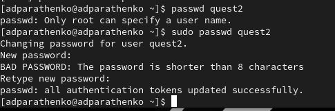{ #fig:002 width=70% }

#### №5
Осуществите вход в систему от двух пользователей на двух разных консолях: guest на первой консоли и guest2 на второй консоли.
(рис. [-@fig:003])

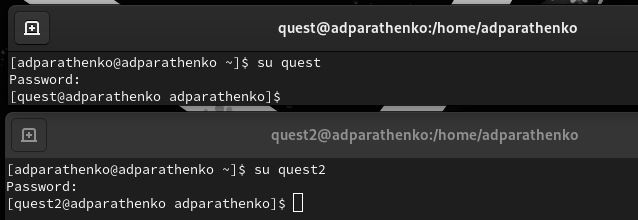{ #fig:003 width=70% }

#### №6
Для обоих пользователей командой pwd определите директорию, в которой вы находитесь.
***pwd***
(рис. [-@fig:004])

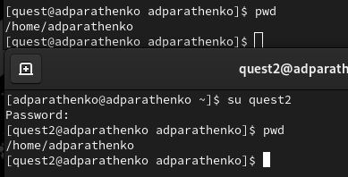{ #fig:004 width=70% }

#### №7
Уточняем имя пользователя, его группу, кто входит в неё и к каким группам принадлежит он сам. Определите командами ***groups guest*** и ***groups guest2***, в какие группы входят пользователи guest и guest2. Сравните вывод команды groups с выводом команд id -Gn и id -G.
(рис. [-@fig:005])

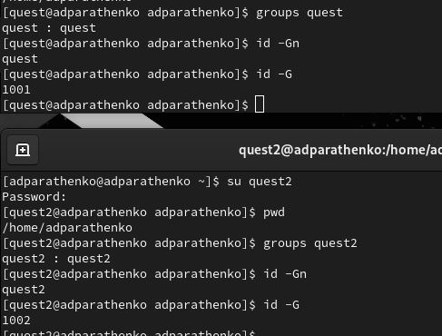{ #fig:005 width=70% }

#### №8
Сравним полученную информацию с содержимым файла ***/etc/group***.
Просмотрите файл командой
***cat /etc/group***
(рис. [-@fig:007]) - (рис. [-@fig:007])

{ #fig:006 width=70% }

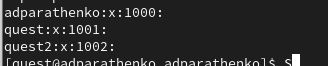{ #fig:007 width=70% }

#### №9
От имени пользователя guest измените права директории ***/home/guest***,
разрешив все действия для пользователей группы:
***chmod g+rwx /home/guest***
(рис. [-@fig:008])

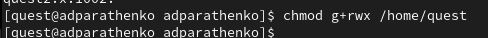{ #fig:008 width=70% }

#### №10
От имени пользователя guest снимите с директории ***/home/guest/dir1*** все атрибуты командой
***chmod 000 dirl***
И проверим изменения командой
***ls -l***
(рис. [-@fig:009])

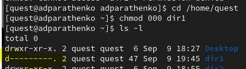{ #fig:009 width=70% }

#### №11
Меняя атрибуты у директории dir1 и файла file1 от имени пользователя guest и делая проверку от пользователя guest2, заполним табл. 3.1,
определив опытным путём, какие операции разрешены, а какие нет. 

Создание файла: “echo”text” > dir1/file1”
Удаление файла: “rm -r dir1/file1”
Запись в файл: “echo”textnew” > dir1/file1”
Чтение файла: “cat dir1/file1”
Смена директории: “cd dir1”
Просмотр файлов в директории: “ls dir1”
Переименование файла: “mv dir1/file1 filenew”
Смена атрибутов файла: “chattr -a dir1/file1”*

(рис. [-@fig:010]) - (рис. [-@fig:014])

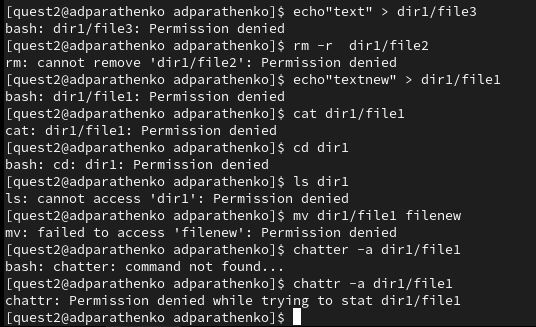{ #fig:010 width=70% }

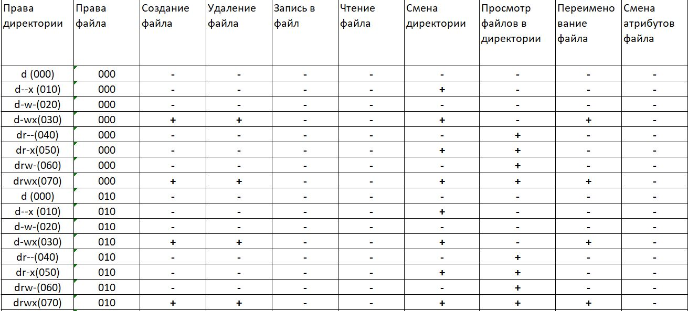{ #fig:011 width=70% }

{ #fig:012 width=70% }

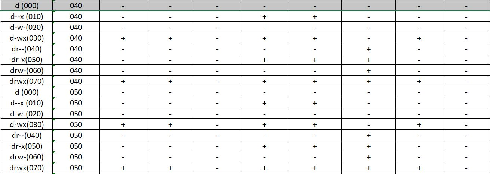{ #fig:013 width=70% }

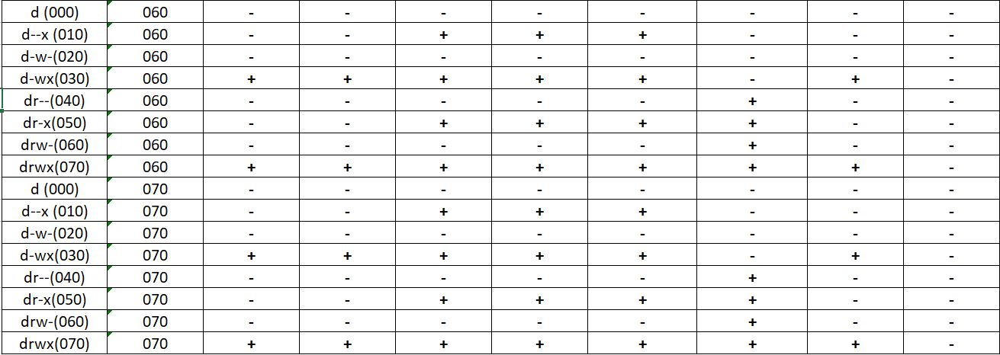{ #fig:014 width=70% }

#### №12
На основании заполненной таблицы определим те или иные минимально необходимые права для выполнения пользователем guest2 операций внутри директории dir1 и заполним табл. 3.2.
рис. [-@fig:015])

{ #fig:015 width=70% }

# Вывод
Получили практические навыки работы в консоли с атрибутами файлов для групп пользователей.

# Литература
1. Команды Linux для работы с файлами
https://losst.pro/komandy-linux-dlya-raboty-s-fajlami#toc-10-touch-sozdat-fayl
2. Права доступа к файлам и папкам в Linux
https://firstvds.ru/technology/linux-permissions
