---## Front mattertitle: "Отчёт по лабораторной работе №3"author: "Паращенко Антонина Дмитриевна"## Generic otionslang: ru-RUtoc-title: "Содержание"## Bibliographybibliography: bib/cite.bibcsl: pandoc/csl/gost-r-7-0-5-2008-numeric.csl## Pdf output formattoc: true # Table of contentstoc-depth: 2lof: true # List of figureslot: true # List of tablesfontsize: 12ptlinestretch: 1.5papersize: a4documentclass: scrreprt## I18n polyglossiapolyglossia-lang:&nbsp; name: russian&nbsp; options:	- spelling=modern	- babelshorthands=truepolyglossia-otherlangs:&nbsp; name: english## I18n babelbabel-lang: russianbabel-otherlangs: english## Fontsmainfont: PT Serifromanfont: PT Serifsansfont: PT Sansmonofont: PT Monomainfontoptions: Ligatures=TeXromanfontoptions: Ligatures=TeXsansfontoptions: Ligatures=TeX,Scale=MatchLowercasemonofontoptions: Scale=MatchLowercase,Scale=0.9## Biblatexbiblatex: truebiblio-style: "gost-numeric"biblatexoptions:&nbsp; - parentracker=true&nbsp; - backend=biber&nbsp; - hyperref=auto&nbsp; - language=auto&nbsp; - autolang=other*&nbsp; - citestyle=gost-numeric## Pandoc-crossref LaTeX customizationfigureTitle: "Рис."tableTitle: "Таблица"listingTitle: "Листинг"lofTitle: "Список иллюстраций"lotTitle: "Список таблиц"lolTitle: "Листинги"## Misc optionsindent: trueheader-includes:&nbsp; - \usepackage{indentfirst}&nbsp; - \usepackage{float} # keep figures where there are in the text&nbsp; - \floatplacement{figure}{H} # keep figures where there are in the text---# Цель работыПолучение практических навыков работы в консоли с атрибутами файлов для групп пользователей.# Ход лабораторной работы## Задание 1#### №1-2В установленной при выполнении предыдущей лабораторной работыоперационной системе учётная запись пользователя guest уже создала и задан пароль.***useradd quest***(рис. [-@fig:001])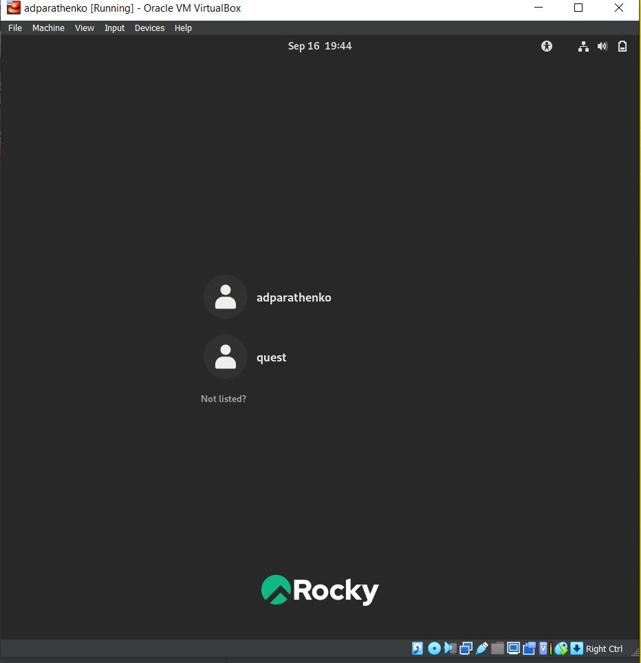{ #fig:001 width=70% }#### №3-4Создаем второго пользователя guest2 с помощью команды:***useradd quest***И добавляем в группу quest:&nbsp;***gpasswd -a quest2 quest***(рис. [-@fig:002])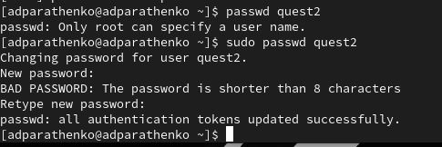{ #fig:002 width=70% }#### №5Осуществите вход в систему от двух пользователей на двух разных консолях: guest на первой консоли и guest2 на второй консоли.(рис. [-@fig:003])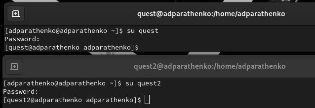{ #fig:003 width=70% }#### №6Для обоих пользователей командой pwd определите директорию, в которой вы находитесь.***pwd***(рис. [-@fig:004])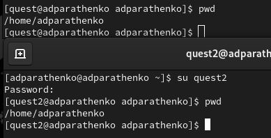{ #fig:004 width=70% }#### №7Уточняем имя пользователя, его группу, кто входит в неё и к каким группам принадлежит он сам. Определите командами ***groups guest*** и ***groups guest2***, в какие группы входят пользователи guest и guest2. Сравните вывод команды groups с выводом команд id -Gn и id -G.(рис. [-@fig:005])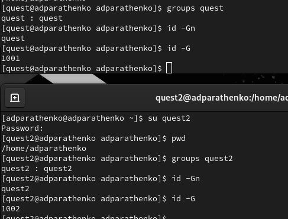{ #fig:005 width=70% }#### №8Сравним полученную информацию с содержимым файла ***/etc/group***.Просмотрите файл командой***cat /etc/group***(рис. [-@fig:007]) - (рис. [-@fig:007])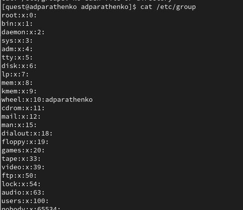{ #fig:006 width=70% }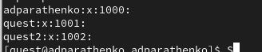{ #fig:007 width=70% }#### №9От имени пользователя guest измените права директории ***/home/guest***,разрешив все действия для пользователей группы:***chmod g+rwx /home/guest***(рис. [-@fig:008])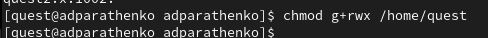{ #fig:008 width=70% }#### №10От имени пользователя guest снимите с директории ***/home/guest/dir1*** все атрибуты командой***chmod 000 dirl***И проверим изменения командой***ls -l***(рис. [-@fig:009])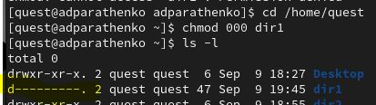{ #fig:009 width=70% }#### №11Меняя атрибуты у директории dir1 и файла file1 от имени пользователя guest и делая проверку от пользователя guest2, заполним табл. 3.1,определив опытным путём, какие операции разрешены, а какие нет.&nbsp;Создание файла: “echo”text” &gt; dir1/file1”Удаление файла: “rm -r dir1/file1”Запись в файл: “echo”textnew” &gt; dir1/file1”Чтение файла: “cat dir1/file1”Смена директории: “cd dir1”Просмотр файлов в директории: “ls dir1”Переименование файла: “mv dir1/file1 filenew”Смена атрибутов файла: “chattr -a dir1/file1”*(рис. [-@fig:010]) - (рис. [-@fig:014])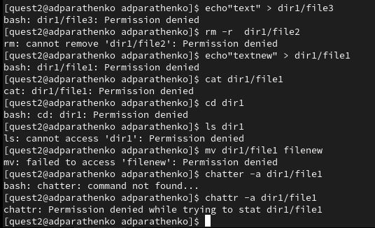{ #fig:010 width=70% }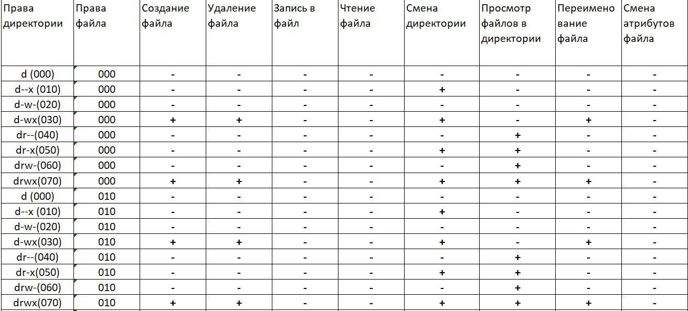{ #fig:011 width=70% }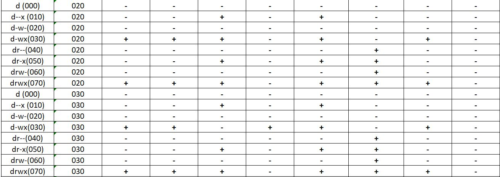{ #fig:012 width=70% }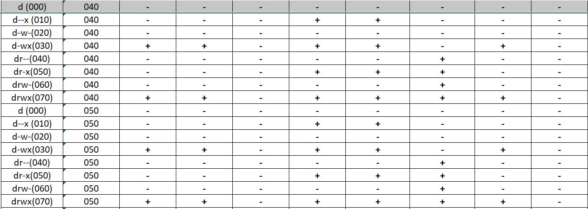{ #fig:013 width=70% }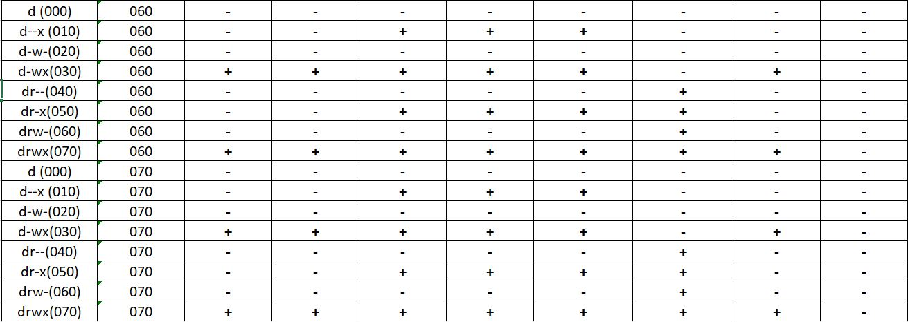{ #fig:014 width=70% }#### №12На основании заполненной таблицы определим те или иные минимально необходимые права для выполнения пользователем guest2 операций внутри директории dir1 и заполним табл. 3.2.рис. [-@fig:015])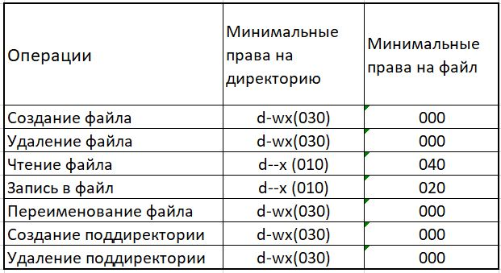{ #fig:015 width=70% }# ВыводПолучили практические навыки работы в консоли с атрибутами файлов для групп пользователей.# Литература1. Команды Linux для работы с файламиhttps://losst.pro/komandy-linux-dlya-raboty-s-fajlami#toc-10-touch-sozdat-fayl2. Права доступа к файлам и папкам в Linuxhttps://firstvds.ru/technology/linux-permissions