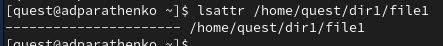
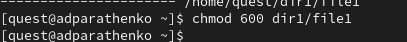
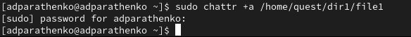
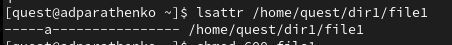
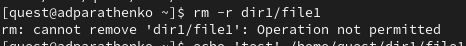
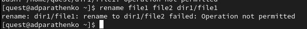
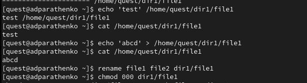

---
## Front matter
title: "Отчёт по лабораторной работе №4"
subtitle: "Дисциплина: Основы информационной безопасности"
author: "Паращенко Антонина Дмитриевна"

## Generic otions
lang: ru-RU
toc-title: "Содержание"

## Bibliography
bibliography: bib/cite.bib
csl: pandoc/csl/gost-r-7-0-5-2008-numeric.csl

## Pdf output format
toc: true # Table of contents
toc-depth: 2
lof: true # List of figures
lot: true # List of tables
fontsize: 12pt
linestretch: 1.5
papersize: a4
documentclass: scrreprt
## I18n polyglossia
polyglossia-lang:
  name: russian
  options:
	- spelling=modern
	- babelshorthands=true
polyglossia-otherlangs:
  name: english
## I18n babel
babel-lang: russian
babel-otherlangs: english
## Fonts
mainfont: PT Serif
romanfont: PT Serif
sansfont: PT Sans
monofont: PT Mono
mainfontoptions: Ligatures=TeX
romanfontoptions: Ligatures=TeX
sansfontoptions: Ligatures=TeX,Scale=MatchLowercase
monofontoptions: Scale=MatchLowercase,Scale=0.9
## Biblatex
biblatex: true
biblio-style: "gost-numeric"
biblatexoptions:
  - parentracker=true
  - backend=biber
  - hyperref=auto
  - language=auto
  - autolang=other*
  - citestyle=gost-numeric
## Pandoc-crossref LaTeX customization
figureTitle: "Рис."
tableTitle: "Таблица"
listingTitle: "Листинг"
lofTitle: "Список иллюстраций"
lotTitle: "Список таблиц"
lolTitle: "Листинги"
## Misc options
indent: true
header-includes:
  - \usepackage{indentfirst}
  - \usepackage{float} # keep figures where there are in the text
  - \floatplacement{figure}{H} # keep figures where there are in the text
---

# Цель работы

Получение практических навыков работы в консоли с расширенными атрибутами файлов. 

# Выполнение лабораторной работы
1)  От имени пользователя guest определяем расширенные атрибуты файла /home/guest/dir1/file1 командой ***lsattr /home/guest/dir1/file1***
 (рис. [-@fig:001])
 
{#fig:001 width=70%}

2)  Установливаем командой ***chmod 600 file1*** на файл file1 права, разрешающие чтение и запись для владельца файла.(рис. [-@fig:002])

{#fig:002 width=70%}

3)  Пробуем установить на файл /home/guest/dir1/file1 расширенный атрибут a от имени пользователя guest: ***chattr +a /home/guest/dir1/file1***
В ответ получили отказ от выполнения операции(рис. [-@fig:003])

{#fig:003 width=70%}

4) Заходим на вторую консоль и повышаем свои права с помощью команды ***sudo***. Установливаем расширенный атрибут ***a*** на файл /home/guest/dir1/file1 от имени суперпользователя: ***chattr +a /home/guest/dir1/file1*** (рис. [-@fig:004])

{#fig:004 width=70%}

5) От пользователя guest проверяем правильность установления атрибута: ***lsattr /home/guest/dir1/file1*** (рис. [-@fig:005])

{#fig:005 width=70%}

6) Выполняем дозапись в файл file1 слова «test» командой ***echo "test" /home/guest/dir1/file1***
После этого выполняем чтение файла file1 командой ***cat /home/guest/dir1/file1***
Убедимся, что слово test было успешно записано в file1. (рис. [-@fig:006])

{#fig:006 width=70%}

7) Попробуйте удалить файл file1 либо стереть имеющуюся в нём информацию командой ***echo "abcd" > /home/guest/dirl/file1*** 
Пробуем переименовать файл(рис. [-@fig:007]), (рис. [-@fig:008]), (рис. [-@fig:009])

{#fig:007 width=70%}

{#fig:008 width=70%}

{#fig:009 width=70%}

8) Пробуем с помощью команды ***chmod 000 file1*** установить на файл file1 права, запрещающие чтение и запись для владельца файла. **Не удалось выполнить указанные команды.**(рис. [-@fig:010])

{#fig:010 width=70%}

9) Снимаем расширенный атрибут **a** с файла /home/guest/dirl/file1 от
имени суперпользователя командой ***sudo chattr -a /home/guest/dir1/file1*** (рис. [-@fig:011])

{#fig:011 width=70%}

И повторяем операции, которые ранее не удавалось выполнить. **Теперь мы можем выполнить операции.** (рис. [-@fig:012])

{#fig:012 width=70%}

10) Повторяем наши действия по шагам, заменив атрибут «a» атрибутом «i». командой ***sudo chattr +i /home/guest/dir1/file1*** (рис. [-@fig:013]), (рис. [-@fig:014])

{#fig:014 width=70%}

{#fig:013 width=70%}

**В данном случае в файл можно было только записать, а изменить/прочитать, переименовать и изменить его атрибуты - нельзя.**

# Вывод

В результате выполнения работы я повысила свои навыки использования интерфейса командой строки (CLI), познакомилась на примерах с тем, как используются основные и расширенные атрибуты при разграничении доступа. Имела возможность связать теорию дискреционного разделения доступа (дискреционная политика безопасности) с её реализацией на практике в ОС Linux. Опробовала действие на практике расширенных атрибутов «а» и «i».

# Список литературы{.unnumbered}
1) https://esystem.rudn.ru/pluginfile.php/2357151/mod_resource/content/3/004-lab_discret_extattr.pdf
::: {#refs}
:::