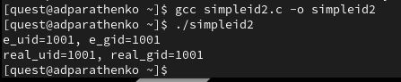

---
## Front matter
title: "Отчёт по лабораторной работе №5"
subtitle: "Дисциплина: Основы информационной безопасности"
author: "Паращенко Антонина Дмитриевна"

## Generic otions
lang: ru-RU
toc-title: "Содержание"

## Bibliography
bibliography: bib/cite.bib
csl: pandoc/csl/gost-r-7-0-5-2008-numeric.csl

## Pdf output format
toc: true # Table of contents
toc-depth: 2
lof: true # List of figures
lot: true # List of tables
fontsize: 12pt
linestretch: 1.5
papersize: a4
documentclass: scrreprt
## I18n polyglossia
polyglossia-lang:
  name: russian
  options:
	- spelling=modern
	- babelshorthands=true
polyglossia-otherlangs:
  name: english
## I18n babel
babel-lang: russian
babel-otherlangs: english
## Fonts
mainfont: PT Serif
romanfont: PT Serif
sansfont: PT Sans
monofont: PT Mono
mainfontoptions: Ligatures=TeX
romanfontoptions: Ligatures=TeX
sansfontoptions: Ligatures=TeX,Scale=MatchLowercase
monofontoptions: Scale=MatchLowercase,Scale=0.9
## Biblatex
biblatex: true
biblio-style: "gost-numeric"
biblatexoptions:
  - parentracker=true
  - backend=biber
  - hyperref=auto
  - language=auto
  - autolang=other*
  - citestyle=gost-numeric
## Pandoc-crossref LaTeX customization
figureTitle: "Рис."
tableTitle: "Таблица"
listingTitle: "Листинг"
lofTitle: "Список иллюстраций"
lotTitle: "Список таблиц"
lolTitle: "Листинги"
## Misc options
indent: true
header-includes:
  - \usepackage{indentfirst}
  - \usepackage{float} # keep figures where there are in the text
  - \floatplacement{figure}{H} # keep figures where there are in the text
---

# Цель работы

Изучение механизмов изменения идентификаторов, применения SetUID- и Sticky-битов. Получение практических навыков работы в консоли с дополнительными атрибутами. Рассмотрение работы механизма смены идентификатора процессов пользователей, а также влияние бита Sticky на запись и удаление файлов.

# Выполнение лабораторной работы

## Подготовка к выполнению лабораторной работы

1)  Проверяем установлен ли компилятор gcc командой ***gcc -v*** (рис. [-@fig:001])
 
{#fig:001 width=70%}

2)  Отключаем систему запретов до очередной перезагрузки системы командой ***setenforce 0*** (рис. [-@fig:002])

{#fig:002 width=70%}

3)  Проверяем наличие компиляторов С и С++ 
***whereis gcc 
whereis g++*** 
(рис. [-@fig:003])

{#fig:003 width=70%}

## Выполнение лабораторной работы
### Создание программы

1) Войдите в систему от имени пользователя guest. 
2) Создайте программу simpleid.c (рис. [-@fig:004]) - (рис. [-@fig:005])

{#fig:004 width=70%}

{#fig:005 width=70%}

3) Скомплилировали программу и убедились, что файл программы создан ***gcc simpleid.c -o simpleid*** 
4) Выполняем программу simpleid
5) Выполняем системную программу id и сравниваем результаты.(рис. [-@fig:006])

{#fig:006 width=70%}

6) Усложняем программу, добавив вывод действительных идентификаторов. Получившуюся программу назовите simpleid2.c. (рис. [-@fig:007])

{#fig:007 width=70%}

7) Компилируем и запускаем simpleid2.c: 
***gcc simpleid2.c -o simpleid2
./simpleid2***
(рис. [-@fig:008])

{#fig:008 width=70%}

8) От имени суперпользователя выполните команды:
***chown root:guest /home/guest/simpleid2
chmod u+s /home/guest/simpleid2***
10) Выполните проверку правильности установки новых атрибутов и смены владельца файла simpleid2:
***ls -l simpleid2***
(рис. [-@fig:009])

{#fig:009 width=70%}

11) Запускаем simpleid2 и id:
***./simpleid2
id***
и сравниваем результаты. (рис. [-@fig:010])

{#fig:010 width=70%}

13) Создайте программу readfile.c: (рис. [-@fig:011]) - (рис. [-@fig:012])

{#fig:011 width=70%}

{#fig:012 width=70%}

14) Откомпилируем програму readfile.c. (рис. [-@fig:013])

{#fig:013 width=70%}

15) Меняем владельца у файла readfile.c (или любого другого текстового файла в системе) и изменяем права так, чтобы только суперпользователь(root) мог прочитать его, a guest не мог. 
16) Проверяем, что пользователь guest не может прочитать файл readfile.c (рис. [-@fig:014])

{#fig:014 width=70%}

17) Меняем у программы readfile владельца и установите SetU’D-бит.
18) Проверяем, может ли программа readfile прочитать файл readfile.c
(рис. [-@fig:015])

{#fig:015 width=70%}

19) Проверяем, может ли программа readfile прочитать файл /etc/shadow (рис. [-@fig:016]) - (рис. [-@fig:017])

{#fig:016 width=70%}
{#fig:017 width=70%}

### Исследование Sticky-бита

1) Выясним, установлен ли атрибут Sticky на директории /tmp командой
***ls -l / | grep tmp***
2) От имени пользователя guest создаём файл *file01.txt* в директории /tmp
со словом test:
***echo "test" > /tmp/file01.txt***
3) Просмотрим атрибуты у только что созданного файла и разрешим чтение и запись для категории пользователей «все остальные»:
***ls -l /tmp/file01.txt
chmod o+rw /tmp/file01.txt
ls -l /tmp/file01.txt***
(рис. [-@fig:018])

{#fig:018 width=70%}

4)От пользователя guest2 (не являющегося владельцем) пробуем прочитать файл */tmp/file01.txt*:
***cat /tmp/file01.txt***
5) От пользователя guest2 пробуем дозаписать в файл */tmp/file01.txt* слово *test2*
***echo "test2" > /tmp/file01.txt***
6) Проверяем содержимое файла
***cat /tmp/file01.txt***
7) От пользователя guest2 пробуем записать в файл */tmp/file01.txt* слово *test3*, стерев при этом всю имеющуюся в файле информацию командой ***echo "test3" > /tmp/file01.txt***
8) Проверяем содержимое файла командой
***cat /tmp/file01.txt***
9) От пользователя guest2 пробуем удалить файл */tmp/file01.txt* командой
***rm /tmp/fileOl.txt***
(рис. [-@fig:019])

{#fig:019 width=70%}

10) Повышаем свои права до суперпользователя следующей командой
***su -***
и выполняем после этого команду, снимающую атрибут t (Sticky-бит) с
директории /tmp:
***chmod -t /tmp***
11) Покидаем режим суперпользователя командой
***exit***
(рис. [-@fig:020])

{#fig:020 width=70%}

12) От пользователя guest2 проверяем, что атрибута t у директории /tmp
нет:
***ls -l / | grep tmp***
13) Повторяем предыдущие шаги. (рис. [-@fig:021])

{#fig:021 width=70%}

15) Повышаем свои права до суперпользователя и возвращаем атрибут t на директорию /tmp:
***su -
chmod +t /tmp
exit***
(рис. [-@fig:022])

{#fig:022 width=70%}

# Вывод

В результате выполнения работы я изучила механизмы изменения идентификаторов, применения SetUID- и Sticky-битов. Рассмотрела работы механизма
смены идентификатора процессов пользователей, а также влияние бита
Sticky на запись и удаление файлов.

# Список литературы{.unnumbered}

1) https://esystem.rudn.ru/pluginfile.php/2357153/mod_resource/content/2/005-lab_discret_sticky.pdf