---
## Front matter
lang: ru-RU
title: Презентация по лабораторной работе №6
subtitle: Основы информационной безопасности
author:
  - Паращенко А.Д.
institute:
  - Российский университет дружбы народов, Москва, Россия
date: 8 октября 2024

## i18n babel
babel-lang: russian
babel-otherlangs: english

## Formatting pdf
toc: false
toc-title: Содержание
slide_level: 2
aspectratio: 169
section-titles: true
theme: metropolis
header-includes:
 - \metroset{progressbar=frametitle,sectionpage=progressbar,numbering=fraction}
---

# Цель работы

1. Развить навыки администрирования ОС Linux. Получить первое практическое знакомство с технологией SELinux1.
2. Проверить работу SELinx на практике совместно с веб-сервером Apache.

# Подготовка к лабораторной работе
## Скачиваем Apache. Обновление
 
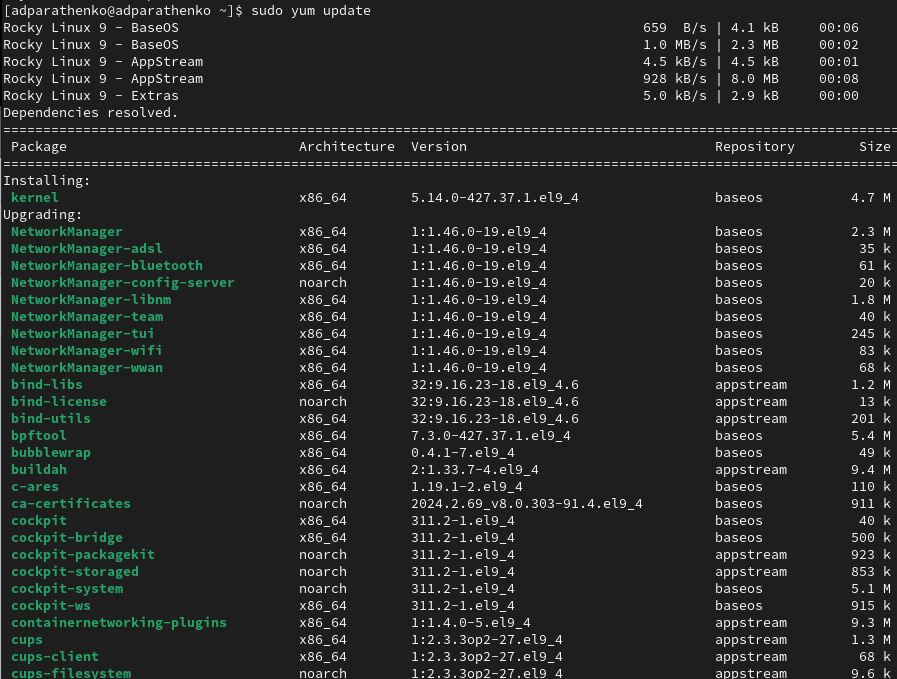{#fig:001 width=70%}

## Скачиваем Apache. Обновление

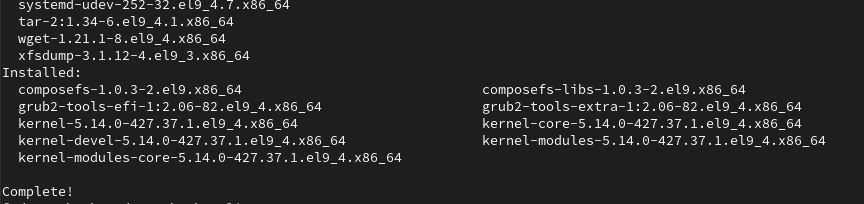{#fig:002 width=70%}

## Скачиваем Apache

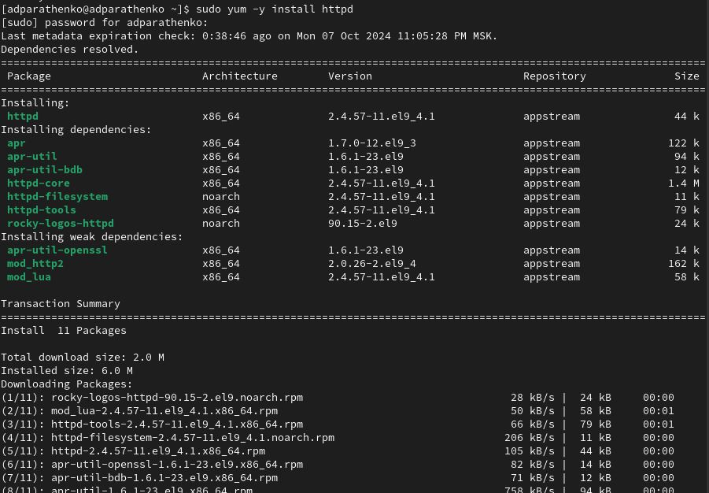{#fig:003 width=70%}

# Выполнение лабораторной работы
## 1
Войдите в систему с полученными учётными данными и убедитесь, что SELinux работает в режиме *enforcing* политики *targeted* с помощью команд ***getenforce*** и ***sestatus***.
(рис. [-@fig:004])

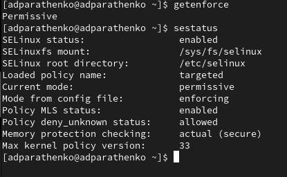{#fig:004 width=70%}

## 2
Обратитесь с помощью браузера к веб-серверу, запущенному на вашем компьютере, и убедитесь, что последний работает: ***service httpd status***
(рис. [-@fig:005])

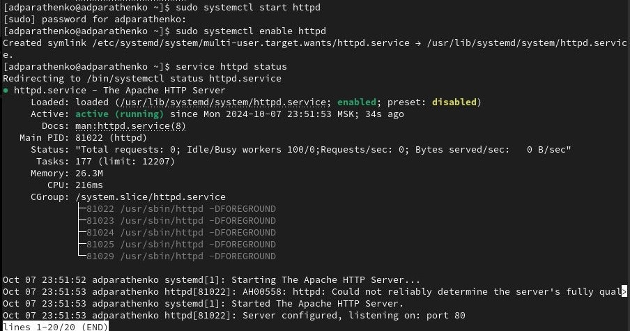{#fig:005 width=70%}

## 3
Найдите веб-сервер Apache в списке процессов, определите его контекст безопасности и занесите эту информацию в отчёт. Например, можно использовать команду ***ps auxZ | grep httpd***
(рис. [-@fig:006])

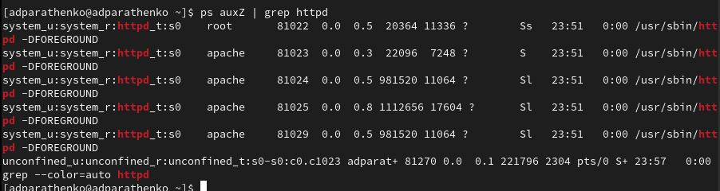{#fig:006 width=70%}

## 4
Посмотрите текущее состояние переключателей SELinux для Apache с помощью команды ***sestatus -bigrep httpd***
(рис. [-@fig:007])

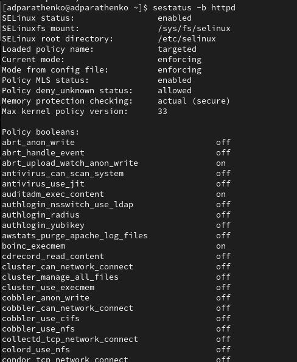{#fig:007 width=70%}

## 5
Посмотрите статистику по политике с помощью команды ***seinfo***, также определите множество пользователей, ролей, типов.
(рис. [-@fig:008])

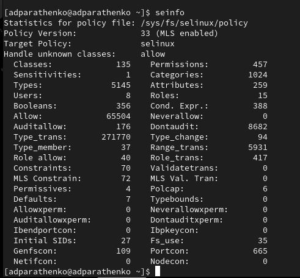{#fig:008 width=70%}

## 6
Определите тип файлов и поддиректорий, находящихся в директории */var/www*, с помощью команды ***ls -lZ /var/www***
(рис. [-@fig:009])

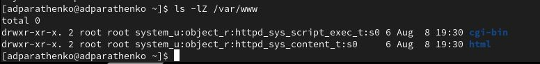{#fig:009 width=70%}

## 7
Определите тип файлов, находящихся в директории */var/www/html*: ***ls -lZ /var/www/html***. Директория пуста.
(рис. [-@fig:010])

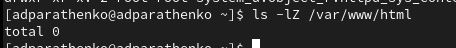{#fig:010 width=70%}

## 8
Создайте от имени суперпользователя (так как в дистрибутиве после установки только ему разрешена запись в директорию) html-файл */var/www/html/test.html*
(рис. [-@fig:011]) - (рис. [-@fig:012])

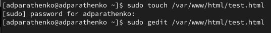{#fig:011 width=70%}

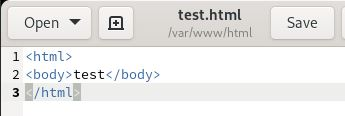{#fig:012 width=70%}

## 9
Проверьте контекст созданного вами файла. Контекст, присваиваемый по умолчанию вновь созданным файлам в директории */var/www/html* это ***httpd_sys_content***
(рис. [-@fig:013])

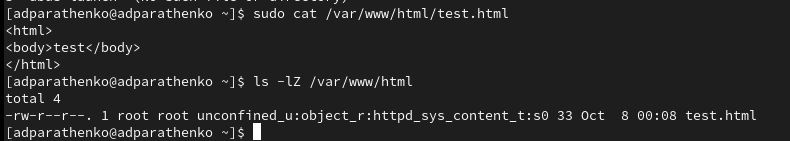{#fig:013 width=70%}

## 10
Обратитесь к файлу через веб-сервер, введя в браузере адрес *http://127.0.0.1/test.html*. Файл был успешно отображён.
(рис. [-@fig:014])

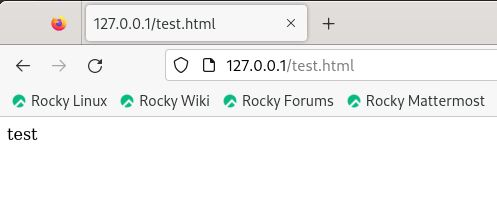{#fig:014 width=70%}

## 11
Изучите справку ***man httpd_selinux***.
(рис. [-@fig:015])

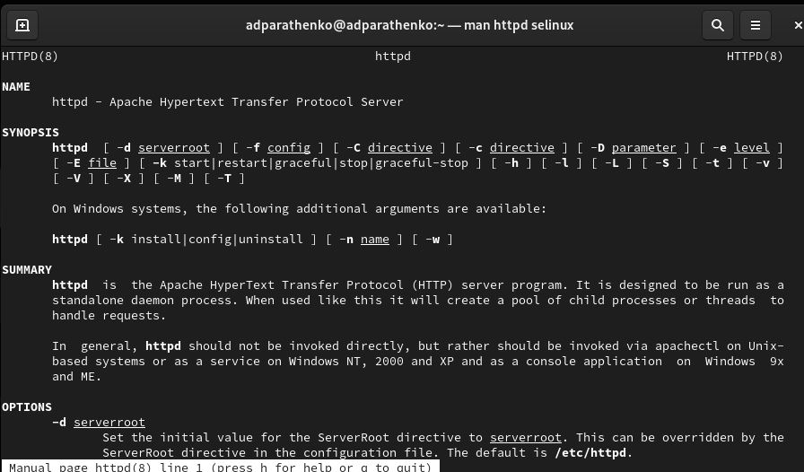{#fig:015 width=70%}

## 12
1) Проверить контекст файла можно командой ***ls -Z. ls -Z /var/www/html/test.html***
2) Измените контекст файла */var/www/html/test.html* с *httpd_sys_content_t* на любой другой, к которому процесс httpd не должен иметь доступа, например, на *samba_share_t*:
***chcon -t samba_share_t /var/www/html/test.html***
***ls -Z /var/www/html/test.html***
(рис. [-@fig:016])

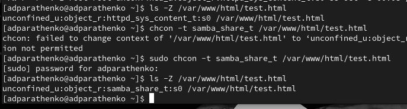{#fig:016 width=70%}

## 13
Попробуйте ещё раз получить доступ к файлу через веб-сервер, введя в браузере адрес *http://127.0.0.1/test.html*. Получили сообщение об ошибке.
(рис. [-@fig:017])

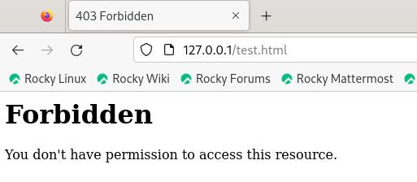{#fig:017 width=70%}

## 14
Просмотрите log-файлы веб-сервера Apache. Также просмотрите системный лог-файл: ***tail /var/log/messages***
(рис. [-@fig:018])

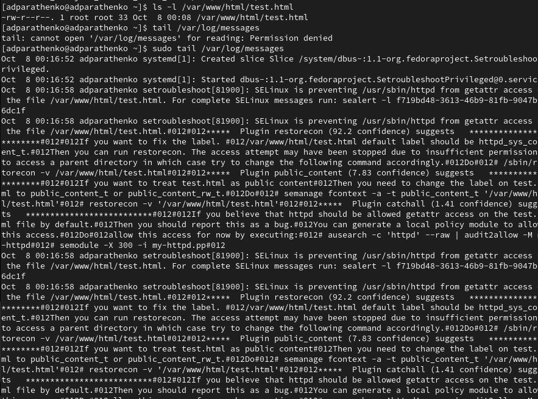{#fig:018 width=70%}

## 15
Попробуйте запустить веб-сервер Apache на прослушивание ТСР-порта 81 (а не 80, как рекомендует IANA и прописано в /etc/services). Для этого в файле */etc/httpd/httpd.conf* найдите строчку *Listen 80* и замените её на *Listen 81*.
(рис. [-@fig:019])

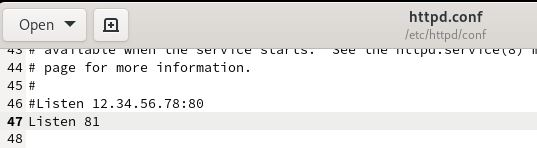{#fig:019 width=70%}

## 16
Выполните перезапуск веб-сервера Apache. Произошел сбой.
(рис. [-@fig:020])

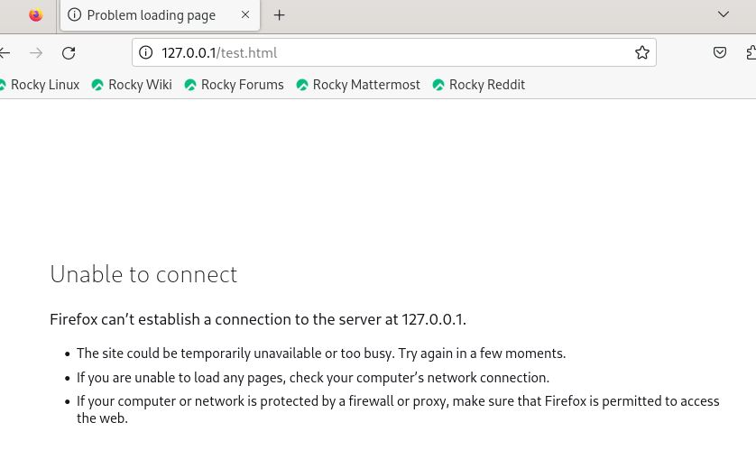{#fig:020 width=70%}

## 17
Проанализируйте лог-файлы: ***tail -nl /var/log/messages***.
(рис. [-@fig:021])

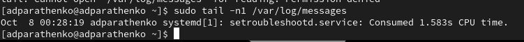{#fig:021 width=70%}

## 18
Просмотрите файлы */var/log/http/error_log, /var/log/http/access_log и /var/log/audit/audit.log*.
(рис. [-@fig:022])

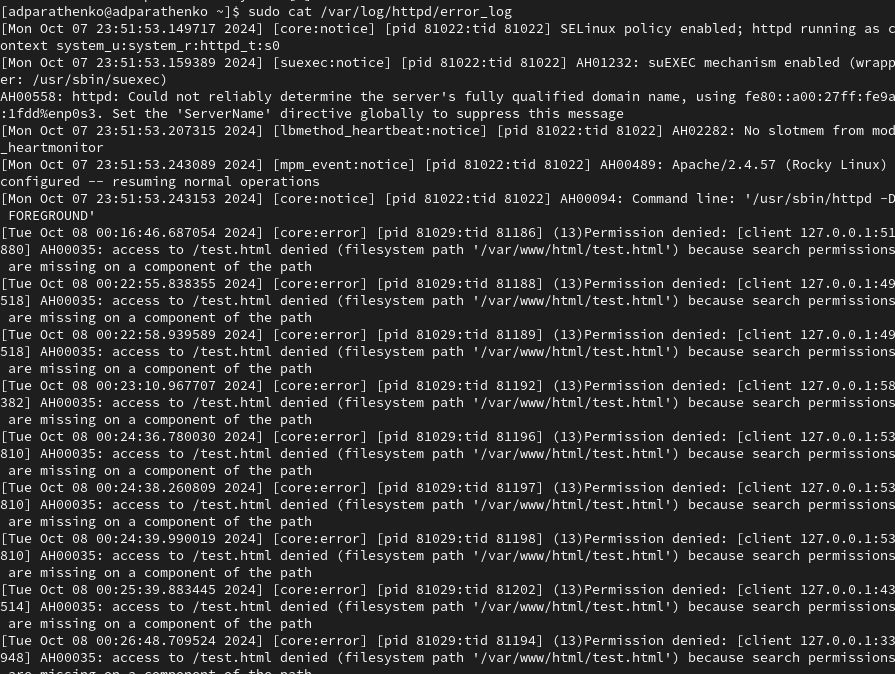{#fig:022 width=70%}

## 19
Выполните команду ***semanage port -a -t http_port_t -р tcp 81***. После этого проверьте список портов командой ***semanage port -l | grep http_port_t***. Порт 81 появился в списке.
(рис. [-@fig:023])

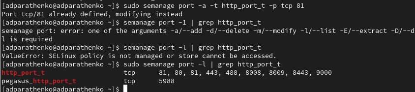{#fig:023 width=70%}

## 20
Попробуйте запустить веб-сервер Apache ещё раз. Сейчас запустился.
Верните контекст **httpd_sys_cоntent__t** к файлу */var/www/html/test.html*: ***chcon -t httpd_sys_content_t /var/www/html/test.html***
После этого попробуйте получить доступ к файлу через веб-сервер, введя в браузере адрес *http://127.0.0.1:81/test.html*. Видим содержимое файла.
(рис. [-@fig:024])

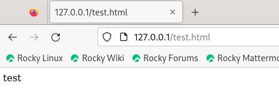{#fig:024 width=70%}

## 21
Исправьте обратно конфигурационный файл apache, вернув Listen 80.
Удалите привязку *http_port_t* к 81 порту: ***semanage port -d -t http_port_t -p tcp 81*** и проверьте, что порт 81 удалён.
(рис. [-@fig:025])

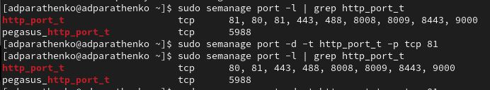{#fig:025 width=70%}

## 22
Удалите файл */var/www/html/test.html*: ***rm /var/www/html/test.html***
(рис. [-@fig:026])

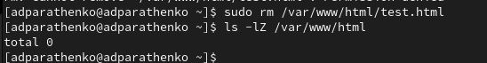{#fig:026 width=70%}

# Вывод

В результате выполнения работы мы получили навыки администрирования ОС Linux, получили первое практическое знакомство с технологией SELinux1, а также проверили работу SELinx на практике совместно с веб-сервером Apache.

# Список литературы{.unnumbered}
1) https://esystem.rudn.ru/pluginfile.php/2357155/mod_resource/content/2/006-lab_selinux.pdf