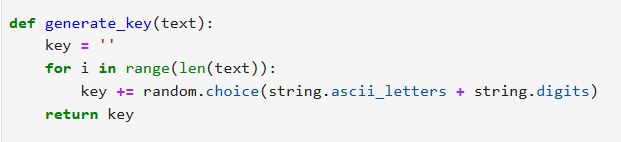
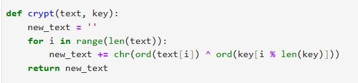
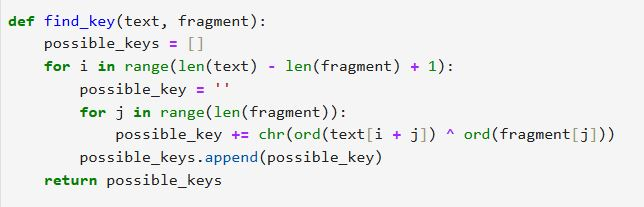
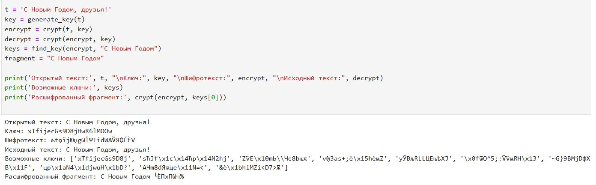
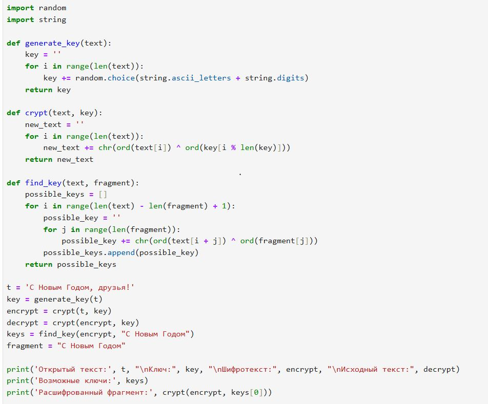

---
## Front matter
lang: ru-RU
title: Отчёт по лабораторной  работе №7
subtitle: Основы информационной безопасности
author:
  - Паращенко А.Д.
institute:
  - Российский университет дружбы народов, Москва, Россия
date: 14 октября 2024

## i18n babel
babel-lang: russian
babel-otherlangs: english

## Formatting pdf
toc: false
toc-title: Содержание
slide_level: 2
aspectratio: 169
section-titles: true
theme: metropolis
header-includes:
 - \metroset{progressbar=frametitle,sectionpage=progressbar,numbering=fraction}
---

# Цель работы

Освоить на практике применение режима однократного гаммирования.

# Выполнение лабораторной работы

## Функция для генерации ключа.

{#fig:001 width=70%}

## Функция для (де)шифрования.

{#fig:002 width=70%}

## Функция для подбора ключа.

{#fig:003 width=70%}

## Код для вывода результатов и результаты.

{#fig:004 width=70%}

## Листинг программы.

{#fig:005 width=70%}

# Вывод

В результате выполнения работы мы научились на практике применять режим однократного гаммирования.

# Список литературы{.unnumbered}
1) https://esystem.rudn.ru/pluginfile.php/2357157/mod_resource/content/2/007-lab_crypto-gamma.pdf