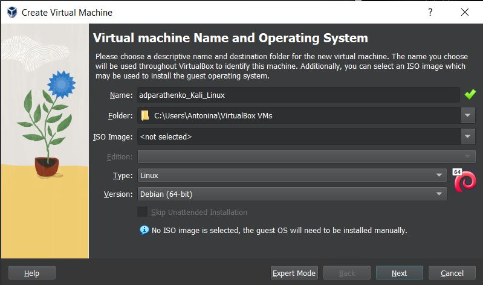
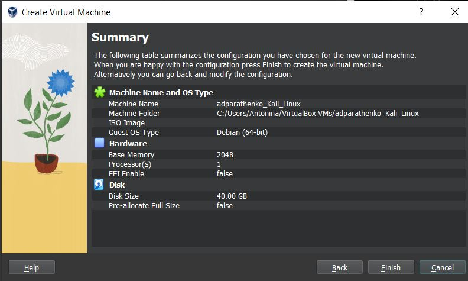
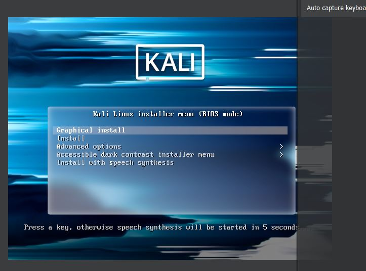
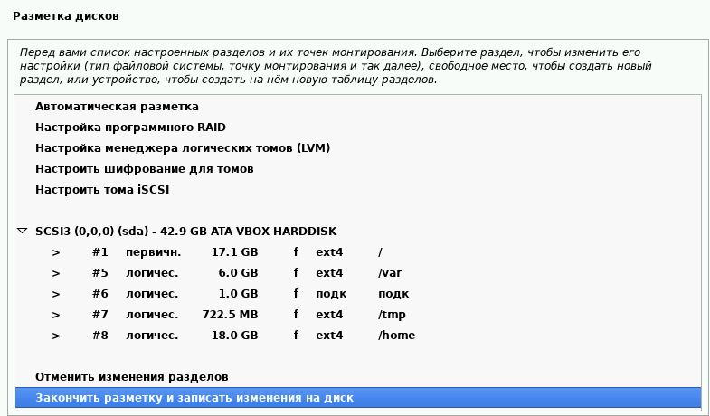
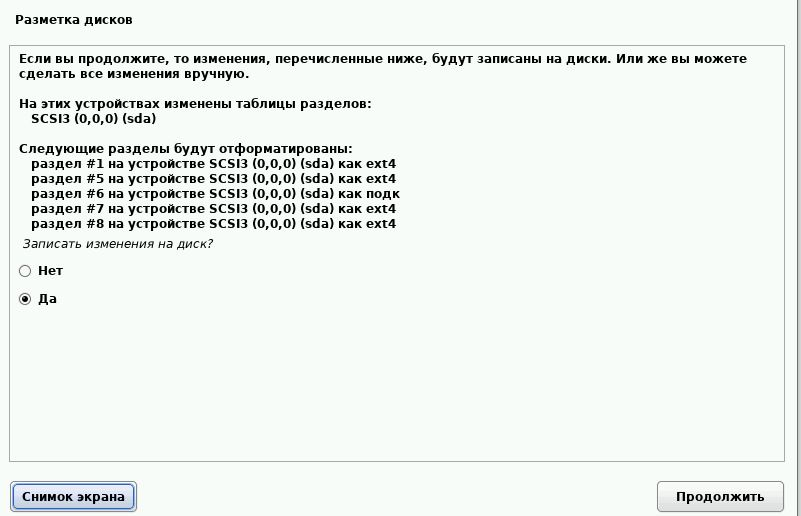
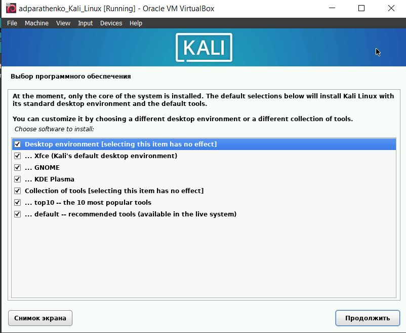
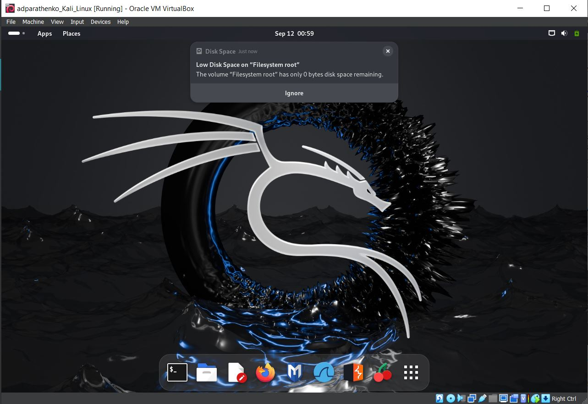

---
## Front matter
lang: ru-RU
title: Structural approach to the deep learning method
author: |
	Parashchenko Antonina
institute: |
	\inst{1}RUDN University, Moscow, Russian Federation

## Formatting
toc: false
slide_level: 2
theme: metropolis
header-includes: 
 - \metroset{progressbar=frametitle,sectionpage=progressbar,numbering=fraction}
 - '\makeatletter'
 - '\beamer@ignorenonframefalse'
 - '\makeatother'
aspectratio: 43
section-titles: true
---

# Цель работы

Установить дистрибутив Kali Linux в виртуальную машину.

# Ход лабораторной работы

## Создание виртуальной машины

#### №1 

Устанавливаем виртуальную машину по инструкции, как в лабораторной работе №1.

(рис. [-@fig:001]) - (рис. [-@fig:004])

 {#fig:001 width=70% }

{ #fig:002 width=70% }

{ #fig:003 width=70% }

{ #fig:004 width=70% }

#### №2 

Подключаем образ Kali Linux.

(рис. [-@fig:005])

{ #fig:005 width=70% }

#### №3

Устанавливаем Kali Linux.

(рис. [-@fig:006])

{ #fig:006 width=70% }

#### №4

Настройки установки.

(рис. [-@fig:007]) - (рис. [-@fig:023])

{ #fig:007 width=70% }

{ #fig:008 width=70% }

{ #fig:009 width=70% }

{ #fig:010 width=70% }

{ #fig:011 width=70% }

{ #fig:012 width=70% }

{ #fig:013 width=70% }

{ #fig:014 width=70% }

{ #fig:015 width=70% }

{ #fig:016 width=70% }

{ #fig:017 width=70% }

{ #fig:018 width=70% }

{ #fig:019 width=70% }

{ #fig:020 width=70% }

{ #fig:021 width=70% }

{ #fig:022 width=70% }

{ #fig:023 width=70% }

#### №5 

Вход в учётную запись.

(рис. [-@fig:024]) - (рис. [-@fig:025])

{ #fig:024 width=70% }

{ #fig:025 width=70% }

#### №6 

Перезагружаем виртуальную машину.

(рис. [-@fig:026])

{ #fig:026 width=70% }

# Вывод
Установили вертуальную машину с дистрибутивом Kali Linux.

# Литература
1. Парасрам, Ш. Kali Linux: Тестирование на проникновение и безопасность : Для профессионалов. Kali Linux / Ш. Парасрам, А. Замм, Т. Хериянто, и др. – Санкт-Петербург : Питер, 2022. – 448 сс.
