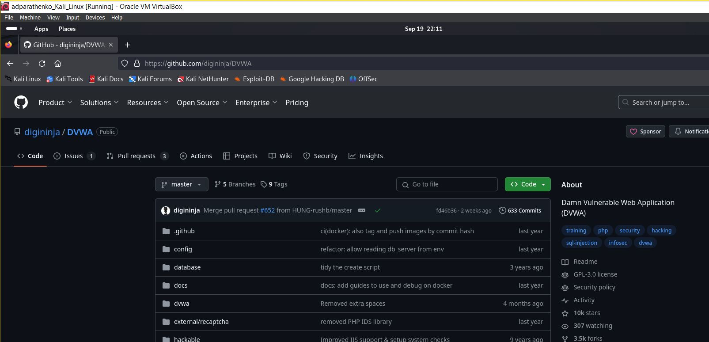
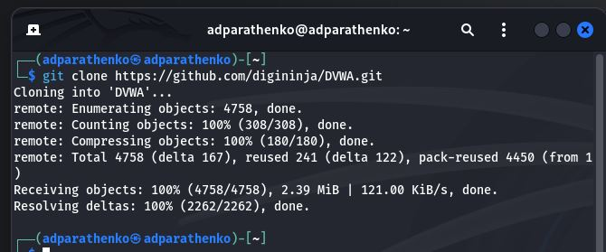

---## Front mattertitle: "Отчёт по индивидуальному проекту, этап №2"author: "Паращенко Антонина Дмитриевна"## Generic otionslang: ru-RUtoc-title: "Содержание"## Bibliographybibliography: bib/cite.bibcsl: pandoc/csl/gost-r-7-0-5-2008-numeric.csl## Pdf output formattoc: true # Table of contentstoc-depth: 2lof: true # List of figureslot: true # List of tablesfontsize: 12ptlinestretch: 1.5papersize: a4documentclass: scrreprt## I18n polyglossiapolyglossia-lang:&nbsp; name: russian&nbsp; options:	- spelling=modern	- babelshorthands=truepolyglossia-otherlangs:&nbsp; name: english## I18n babelbabel-lang: russianbabel-otherlangs: english## Fontsmainfont: PT Serifromanfont: PT Serifsansfont: PT Sansmonofont: PT Monomainfontoptions: Ligatures=TeXromanfontoptions: Ligatures=TeXsansfontoptions: Ligatures=TeX,Scale=MatchLowercasemonofontoptions: Scale=MatchLowercase,Scale=0.9## Biblatexbiblatex: truebiblio-style: "gost-numeric"biblatexoptions:&nbsp; - parentracker=true&nbsp; - backend=biber&nbsp; - hyperref=auto&nbsp; - language=auto&nbsp; - autolang=other*&nbsp; - citestyle=gost-numeric## Pandoc-crossref LaTeX customizationfigureTitle: "Рис."tableTitle: "Таблица"listingTitle: "Листинг"lofTitle: "Список иллюстраций"lotTitle: "Список таблиц"lolTitle: "Листинги"## Misc optionsindent: trueheader-includes:&nbsp; - \usepackage{indentfirst}&nbsp; - \usepackage{float} # keep figures where there are in the text&nbsp; - \floatplacement{figure}{H} # keep figures where there are in the text---# Цель работыУстановите DVWA в гостевую систему к Kali Linux.# Ход лабораторной работы#### №1&nbsp;Запускаем виртуальную машину Kali Linux.(рис. [-@fig:001])&nbsp; {#fig:001 width=70% }#### №2&nbsp;Заходим на репозиторий https://github.com/digininja/DVWA на виртуальной машине.(рис. [-@fig:002]){ #fig:002 width=70% }#### №3Устанавливаем DVWA с помощью каоманды ***dit clone https://github.com/digininja/DVWA.git***(рис. [-@fig:003]){ #fig:003 width=70% }# ВыводУстановили DVWA в гостевую систему к Kali Linux.# Литература1. Парасрам, Ш. Kali Linux: Тестирование на проникновение и безопасность : Для профессионалов. Kali Linux / Ш. Парасрам, А. Замм, Т. Хериянто, и др. – Санкт-Петербург : Питер, 2022. – 448 сс.– Санкт-Петербург : Питер, 2022. – 448 сс.