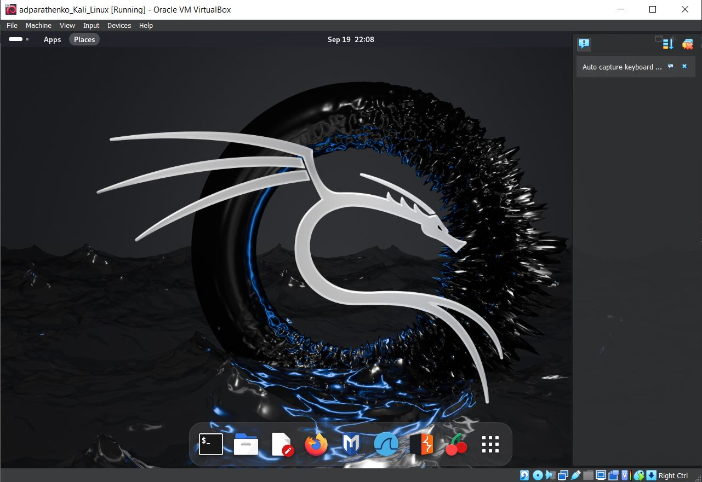
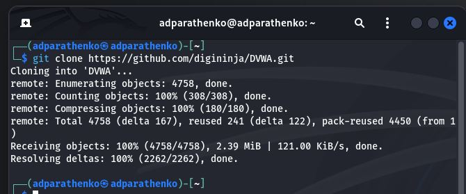

---
## Front matter
lang: ru-RU
title: Отчёт по индивидуальному проекту, этап №2
author: Паращенко Антонина Дмитриевна
institute: РУДН, Москва, Россия
date: 19 сентября 2024

## Formatting
toc: false
slide_level: 2
theme: metropolis
header-includes: 
 - \metroset{progressbar=frametitle,sectionpage=progressbar,numbering=fraction}
 - '\makeatletter'
 - '\beamer@ignorenonframefalse'
 - '\makeatother'
aspectratio: 43
section-titles: true
---

# Цель работы

Установите DVWA в гостевую систему к Kali Linux.

# Ход лабораторной работы

#### №1 

Запускаем виртуальную машину Kali Linux.

(рис. [-@fig:001]) 

 {#fig:001 width=70% }

#### №2 

Заходим на репозиторий https://github.com/digininja/DVWA на виртуальной машине.

(рис. [-@fig:002])

{ #fig:002 width=70% }

#### №3

Устанавливаем DVWA с помощью каоманды ***dit clone https://github.com/digininja/DVWA.git***

(рис. [-@fig:003])

{ #fig:003 width=70% }

# Вывод
Установили DVWA в гостевую систему к Kali Linux.

# Литература
1. Парасрам, Ш. Kali Linux: Тестирование на проникновение и безопасность : Для профессионалов. Kali Linux / Ш. Парасрам, А. Замм, Т. Хериянто, и др. – Санкт-Петербург : Питер, 2022. – 448 сс.
– Санкт-Петербург : Питер, 2022. – 448 сс.
