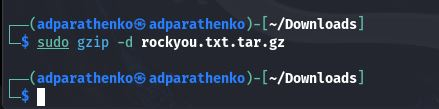

---
## Front matter
lang: ru-RU
title: Презентация по по индивидуальному проекту этап №3
subtitle: Основы информационной безопасности
author:
  - Паращенко А.Д.
institute:
  - Российский университет дружбы народов, Москва, Россия
date: 23 сентября 2024

## i18n babel
babel-lang: russian
babel-otherlangs: english

## Fonts
mainfont: PT Serif
romanfont: PT Serif
sansfont: PT Sans
monofont: PT Mono
mainfontoptions: Ligatures=TeX
romanfontoptions: Ligatures=TeX
sansfontoptions: Ligatures=TeX,Scale=MatchLowercase
monofontoptions: Scale=MatchLowercase,Scale=0.9

## Formatting pdf
toc: false
toc-title: Содержание
slide_level: 2
aspectratio: 169
section-titles: true
theme: metropolis
header-includes:
 - \metroset{progressbar=frametitle,sectionpage=progressbar,numbering=fraction}
 - '\makeatletter'
 - '\beamer@ignorenonframefalse'
 - '\makeatother'
---

# Цель работы

Использование Hydra для подбора или взлома имени пользователя и пароля.

---

# Выполнение лабораторной работы
1) Скачиваем текстовый документ *rockyou.txt.tar.gz* с паролями для Linux  командой ***sudo gzip -d rockyou.txt.tar.gz***.(рис.[1])
 

---
2) Установливаем в браузере расширение для просмотра cookie и копируем значение PHPSESSID для дальнейшей работы.(рис.[2])

---
3) Запускаем работу Hydra. Для авторизации используется html форма, которая отправляет методом POST запрос вида username=root&password=test_password. Выбираем любую выданную пару логина и пароля.(рис.[3])

---
4) Заходим обратно на сайт и вводим выбранную пару логин-пароль и получаем результат взлома.(рис.[4])

---

# Вывод

В результате выполнения работы мы смогли познакомиться с функциями Hydra и взломать аккаунт admin.

---
# Список литературы{.unnumbered}
1) https://esystem.rudn.ru/mod/page/view.php?id=1140635
::: {#refs}
:::

---