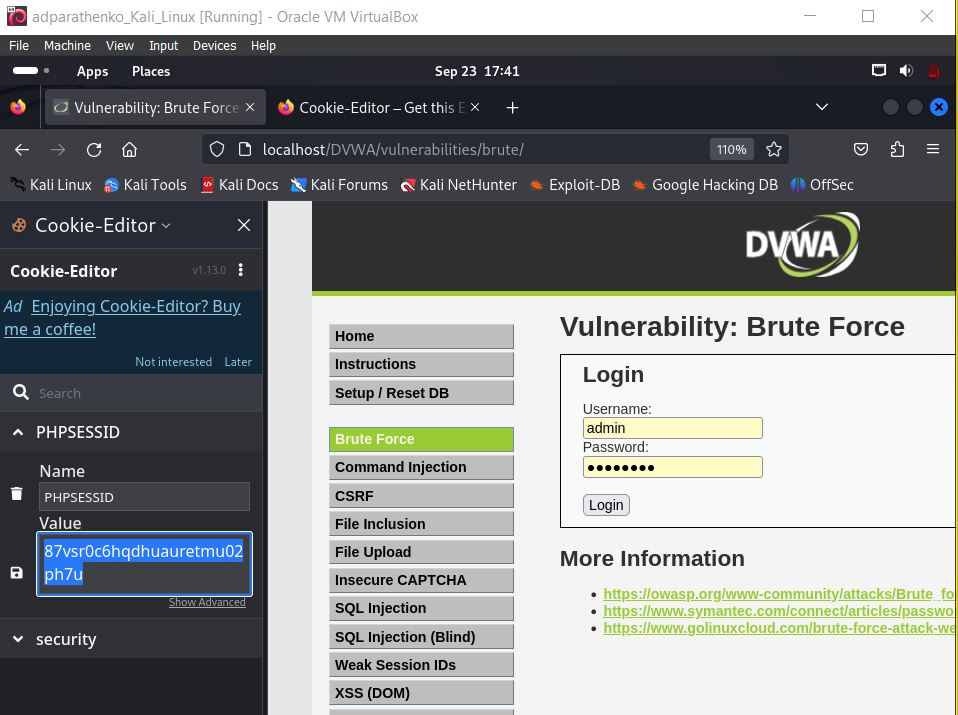
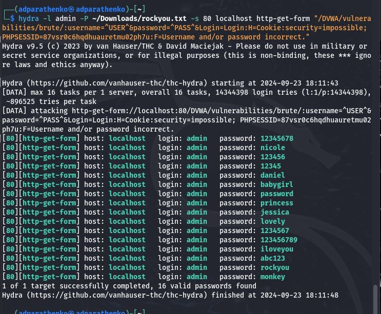
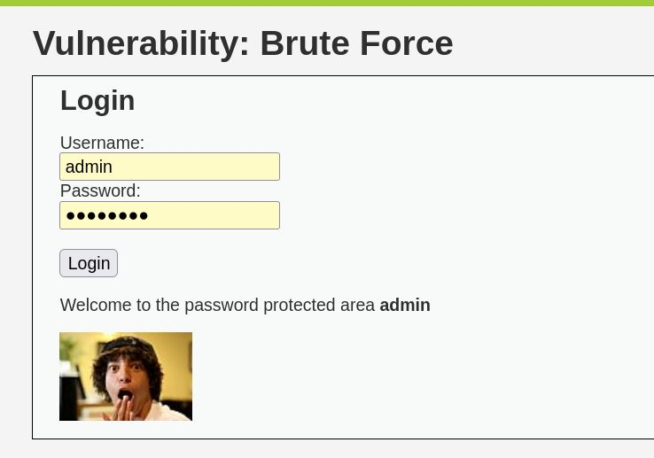

---
## Front matter
title: "Отчёт по индивидуальному проекту этап №3"
subtitle: "Дисциплина: Основы информационной безопасности"
author: "Паращенко Антонина Дмитриевна"

## Generic otions
lang: ru-RU
toc-title: "Содержание"

## Bibliography
bibliography: bib/cite.bib
csl: pandoc/csl/gost-r-7-0-5-2008-numeric.csl

## Pdf output format
toc: true # Table of contents
toc-depth: 2
lof: true # List of figures
lot: true # List of tables
fontsize: 12pt
linestretch: 1.5
papersize: a4
documentclass: scrreprt
## I18n polyglossia
polyglossia-lang:
  name: russian
  options:
	- spelling=modern
	- babelshorthands=true
polyglossia-otherlangs:
  name: english
## I18n babel
babel-lang: russian
babel-otherlangs: english
## Fonts
mainfont: PT Serif
romanfont: PT Serif
sansfont: PT Sans
monofont: PT Mono
mainfontoptions: Ligatures=TeX
romanfontoptions: Ligatures=TeX
sansfontoptions: Ligatures=TeX,Scale=MatchLowercase
monofontoptions: Scale=MatchLowercase,Scale=0.9
## Biblatex
biblatex: true
biblio-style: "gost-numeric"
biblatexoptions:
  - parentracker=true
  - backend=biber
  - hyperref=auto
  - language=auto
  - autolang=other*
  - citestyle=gost-numeric
## Pandoc-crossref LaTeX customization
figureTitle: "Рис."
tableTitle: "Таблица"
listingTitle: "Листинг"
lofTitle: "Список иллюстраций"
lotTitle: "Список таблиц"
lolTitle: "Листинги"
## Misc options
indent: true
header-includes:
  - \usepackage{indentfirst}
  - \usepackage{float} # keep figures where there are in the text
  - \floatplacement{figure}{H} # keep figures where there are in the text
---

# Цель работы

Использование Hydra для подбора или взлома имени пользователя и пароля.

# Выполнение лабораторной работы
1) Скачиваем текстовый документ *rockyou.txt.tar.gz* с паролями для Linux  командой ***sudo gzip -d rockyou.txt.tar.gz***.(рис.[1])
 

2) Установливаем в браузере расширение для просмотра cookie и копируем значение PHPSESSID для дальнейшей работы.(рис.[2])

3) Запускаем работу Hydra. Для авторизации используется html форма, которая отправляет методом POST запрос вида username=root&password=test_password. Выбираем любую выданную пару логина и пароля.(рис.[3])

4) Заходим обратно на сайт и вводим выбранную пару логин-пароль и получаем результат взлома.(рис.[4])

# Вывод

В результате выполнения работы мы смогли познакомиться с функциями Hydra и взломать аккаунт admin.

# Список литературы{.unnumbered}
1) https://esystem.rudn.ru/mod/page/view.php?id=1140635
::: {#refs}
:::