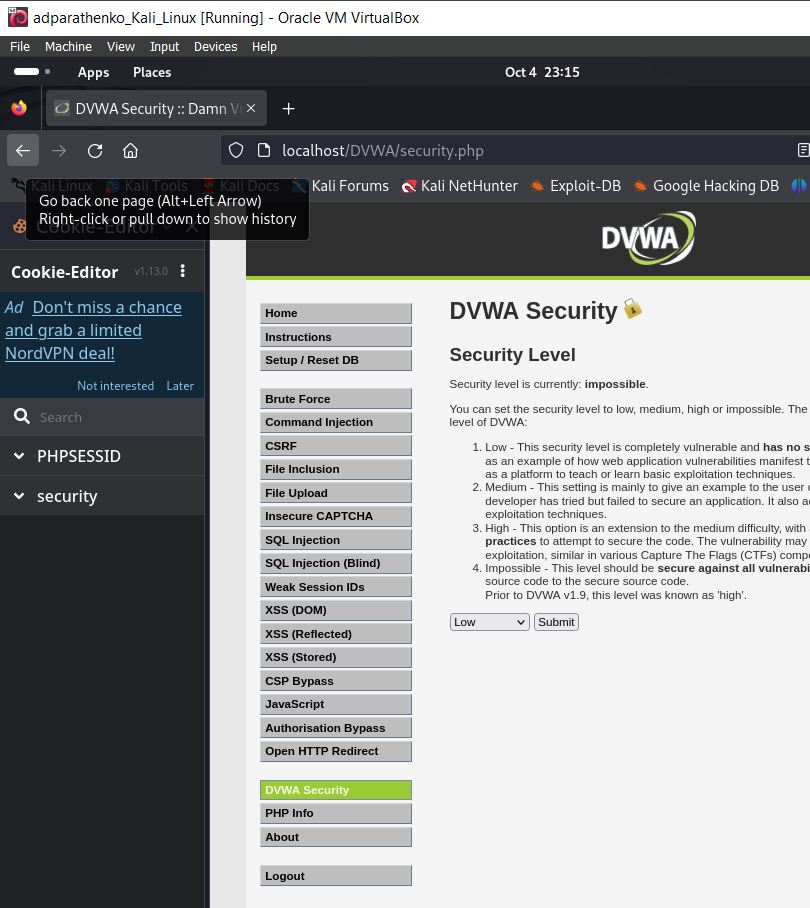

---
## Front matter
lang: ru-RU
title: Презентация по индивидуальному проекту этап №4
subtitle: Основы информационной безопасности
author:
  - Паращенко А.Д.
institute:
  - Российский университет дружбы народов, Москва, Россия
date: 5 октября 2024

## i18n babel
babel-lang: russian
babel-otherlangs: english

## Formatting pdf
toc: false
toc-title: Содержание
slide_level: 2
aspectratio: 169
section-titles: true
theme: metropolis
header-includes:
 - \metroset{progressbar=frametitle,sectionpage=progressbar,numbering=fraction}
---

# Цель работы

Изучить работу базового сканера безопасности веб-сервера ***nikto***. Просканировать уязвимости в веб-приложении DVWA. 

# Выполнение лабораторной работы
## 1
1)Подготавливаем приложение DVWA для сканирования.
 (рис. [-@fig:001])
 
{#fig:001 width=70%}

## 2
2)  Заходим на сайт DVWA и и меняем уровень безопасности на минимальный.
(рис. [-@fig:002])

{#fig:002 width=70%}

## 3
3)  Запускаем сканер *nikto*.
(рис. [-@fig:003])

{#fig:003 width=70%}

## 4
4) Сканируем веб-приложение по полному адресу.
(рис. [-@fig:004])

{#fig:004 width=70%}

## 5
5) Сканируем веб-приложение по адресу хоста и адресу порта.
(рис. [-@fig:005])

{#fig:005 width=70%}

# Вывод

В результате выполнения работы мы познакомились с работой базового сканера безопасности веб-сервера ***nikto***, а также просканировали уязвимости в веб-приложении DVWA. 

## Список литературы{.unnumbered}

1) https://esystem.rudn.ru/pluginfile.php/2357153/mod_resource/content/2/005-lab_discret_sticky.pdf