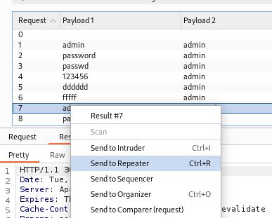

---
## Front matter
lang: ru-RU
title: Отчёт по индивидуальному проекту этап №5
subtitle: Основы информационной безопасности
author:
  - Паращенко А.Д.
institute:
  - Российский университет дружбы народов, Москва, Россия
date: 8 октября 2024

## i18n babel
babel-lang: russian
babel-otherlangs: english

## Formatting pdf
toc: false
toc-title: Содержание
slide_level: 2
aspectratio: 169
section-titles: true
theme: metropolis
header-includes:
 - \metroset{progressbar=frametitle,sectionpage=progressbar,numbering=fraction}
---

# Цель работы

Научиться использовать на практике Burp Suite.

# Выполнение лабораторной работы

## 1
Запускаем локальный сервер, на котором откроем веб-приложение DVWA для тестирования инструмента Burp Suite.
(рис. [-@fig:001])

{#fig:001 width=70%}

## 2
Запускаем Burp Suite.
(рис. [-@fig:002])

{#fig:002 width=70%}

## 3
Изменяем настройки в Proxy на *Intercept is on*.
рис. [-@fig:003])

{#fig:003 width=70%}

## 4
Изменяем настройки сервера в браузере для работы с Proxy и захватом данных с помощью Burp Suite.
(рис. [-@fig:004])

{#fig:004 width=70%}

## 5
Устанавливаем параметр network_allow_hijacking_localhost на true.
(рис. [-@fig:005])

{#fig:005 width=70%}

## 6
В браузере заходим на DVWA и во вкладке Proxy появляется захваченный запрос. нажимаем Forward, чтобы загрузить страницу.
(рис. [-@fig:006])

{#fig:006 width=70%}

## 7
Загрузилась страница авторизации.
(рис. [-@fig:007])

{#fig:007 width=70%}

## 8
Историю запросов можно посмотреть во вкладке Target.
(рис. [-@fig:008])

{#fig:008 width=70%}

## 9
Вводя случайный логин и пароль, в запросе мы увидим введенные данные.
(рис. [-@fig:009])

{#fig:009 width=70%}

## 10
Находим этот запрос во вкладке Target и, нажимая на правую кнопку мыши, нажимаем на Send to Intruder. Попадая во вкладку мы видим вид атаки.
(рис. [-@fig:010])

{#fig:010 width=70%}

## 11
Меняем вид атаки на Cluster bomb и выделяем специальными знаками данные ввода, которые хотим подбирать, в нашем случае, это логин и пароль.
(рис. [-@fig:011])

{#fig:011 width=70%}

## 12
Далее добавляем 2 списка параметров для подбора логина и пароля.
(рис. [-@fig:012]) -(рис. [-@fig:013])

{#fig:012 width=70%}

{#fig:013 width=70%}

## 13
Запускаем атаку и получаем результаты перебора.
(рис. [-@fig:014])

{#fig:014 width=70%}

## 14
У всех вариантов перебора, кроме одного, *location: login.php*.
(рис. [-@fig:015])

{#fig:015 width=70%}

## 15
А у пары ***admin password*** результат *location: index.php*. Это показывает нам, что это верная пара логин-пароль.
(рис. [-@fig:016])

{#fig:016 width=70%}

## 16
Чтобы ещё раз проверить результат мы отправляем эту пару на повторную проверку *Send to Repeater*.
(рис. [-@fig:017])

{#fig:017 width=70%}

## 17
Получаем тот же реузльтат *location: index.php*.
(рис. [-@fig:018])

{#fig:018 width=70%}

## 18
Нажимаем на *Follow redirection* и получаем нескомпилированный html код в окне Response.
(рис. [-@fig:019])

{#fig:019 width=70%}

## 19
В подокне Render получаем вид страницы в браузере.
(рис. [-@fig:020])

{#fig:020 width=70%}

# Вывод

В результате выполнения работы мы научились использовать инструмент Burp Suite и перебором возможных пар подобрали пару логин-пароль для входа на сайт.

# Список литературы{.unnumbered}
1) Парасрам, Ш. Kali Linux: Тестирование на проникновение и безопасность : Для профессионалов. Kali Linux / Ш. Парасрам, А. Замм, Т. Хериянто, и др. – Санкт-Петербург : Питер, 2022. – 448 сс.