---
## Front matter
title: "Отчёт по индивидуальному проекту этап №5"
subtitle: "Дисциплина: Основы информационной безопасности"
author: "Паращенко Антонина Дмитриевна"

## Generic otions
lang: ru-RU
toc-title: "Содержание"

## Bibliography
bibliography: bib/cite.bib
csl: pandoc/csl/gost-r-7-0-5-2008-numeric.csl

## Pdf output format
toc: true # Table of contents
toc-depth: 2
lof: true # List of figures
lot: true # List of tables
fontsize: 12pt
linestretch: 1.5
papersize: a4
documentclass: scrreprt
## I18n polyglossia
polyglossia-lang:
  name: russian
  options:
	- spelling=modern
	- babelshorthands=true
polyglossia-otherlangs:
  name: english
## I18n babel
babel-lang: russian
babel-otherlangs: english
## Fonts
mainfont: PT Serif
romanfont: PT Serif
sansfont: PT Sans
monofont: PT Mono
mainfontoptions: Ligatures=TeX
romanfontoptions: Ligatures=TeX
sansfontoptions: Ligatures=TeX,Scale=MatchLowercase
monofontoptions: Scale=MatchLowercase,Scale=0.9
## Biblatex
biblatex: true
biblio-style: "gost-numeric"
biblatexoptions:
  - parentracker=true
  - backend=biber
  - hyperref=auto
  - language=auto
  - autolang=other*
  - citestyle=gost-numeric
## Pandoc-crossref LaTeX customization
figureTitle: "Рис."
tableTitle: "Таблица"
listingTitle: "Листинг"
lofTitle: "Список иллюстраций"
lotTitle: "Список таблиц"
lolTitle: "Листинги"
## Misc options
indent: true
header-includes:
  - \usepackage{indentfirst}
  - \usepackage{float} # keep figures where there are in the text
  - \floatplacement{figure}{H} # keep figures where there are in the text
---

# Цель работы

Научиться использовать на практике Burp Suite.

# Выполнение лабораторной работы

1) Запускаем локальный сервер, на котором откроем веб-приложение DVWA для тестирования инструмента Burp Suite.
(рис. [-@fig:001])

{#fig:001 width=70%}

2) Запускаем Burp Suite.
(рис. [-@fig:002])

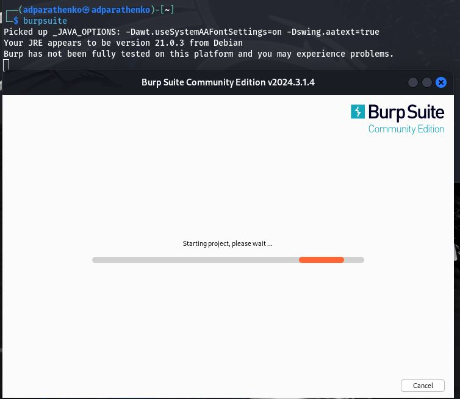{#fig:002 width=70%}

3) Изменяем настройки в Proxy на *Intercept is on*.
рис. [-@fig:003])

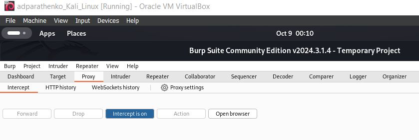{#fig:003 width=70%}

4) Изменяем настройки сервера в браузере для работы с Proxy и захватом данных с помощью Burp Suite.
(рис. [-@fig:004])

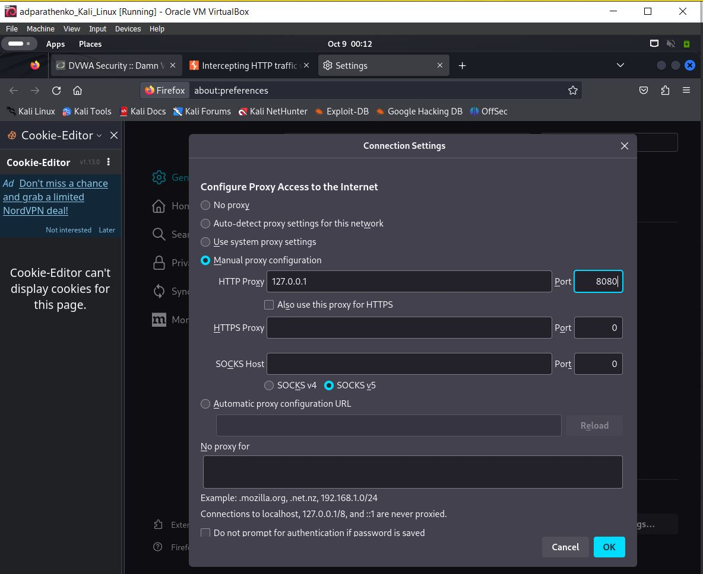{#fig:004 width=70%}

5) Устанавливаем параметр network_allow_hijacking_localhost на true.
(рис. [-@fig:005])

{#fig:005 width=70%}

6) В браузере заходим на DVWA и во вкладке Proxy появляется захваченный запрос. нажимаем Forward, чтобы загрузить страницу.
(рис. [-@fig:006])

{#fig:006 width=70%}

7) Загрузилась страница авторизации.
(рис. [-@fig:007])

{#fig:007 width=70%}

8) Историю запросов можно посмотреть во вкладке Target.
(рис. [-@fig:008])

{#fig:008 width=70%}

9) Вводя случайный логин и пароль, в запросе мы увидим введенные данные.
(рис. [-@fig:009])

{#fig:009 width=70%}

10) Находим этот запрос во вкладке Target и, нажимая на правую кнопку мыши, нажимаем на Send to Intruder. Попадая во вкладку мы видим вид атаки.
(рис. [-@fig:010])

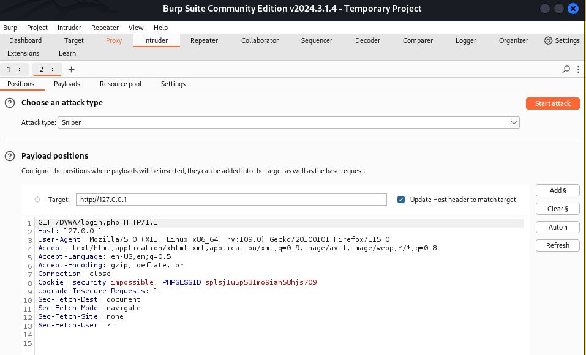{#fig:010 width=70%}

11) Меняем вид атаки на Cluster bomb и выделяем специальными знаками данные ввода, которые хотим подбирать, в нашем случае, это логин и пароль.
(рис. [-@fig:011])

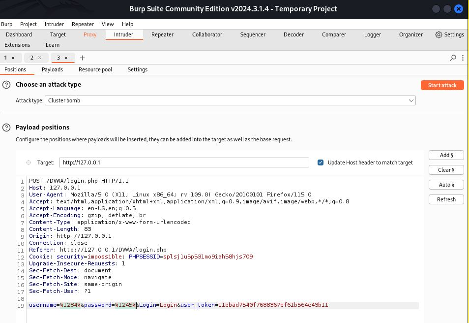{#fig:011 width=70%}

12) Далее добавляем 2 списка параметров для подбора логина и пароля.
(рис. [-@fig:012]) -(рис. [-@fig:013])

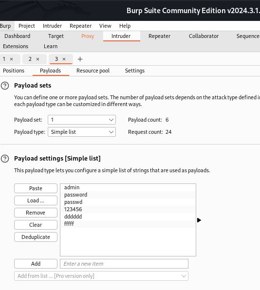{#fig:012 width=70%}

{#fig:013 width=70%}

13) Запускаем атаку и получаем результаты перебора.
(рис. [-@fig:014])

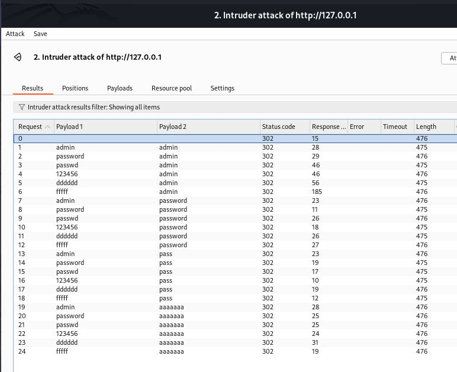{#fig:014 width=70%}

14) У всех вариантов перебора, кроме одного, *location: login.php*.
(рис. [-@fig:015])

{#fig:015 width=70%}

15) А у пары ***admin password*** результат *location: index.php*. Это показывает нам, что это верная пара логин-пароль.
(рис. [-@fig:016])

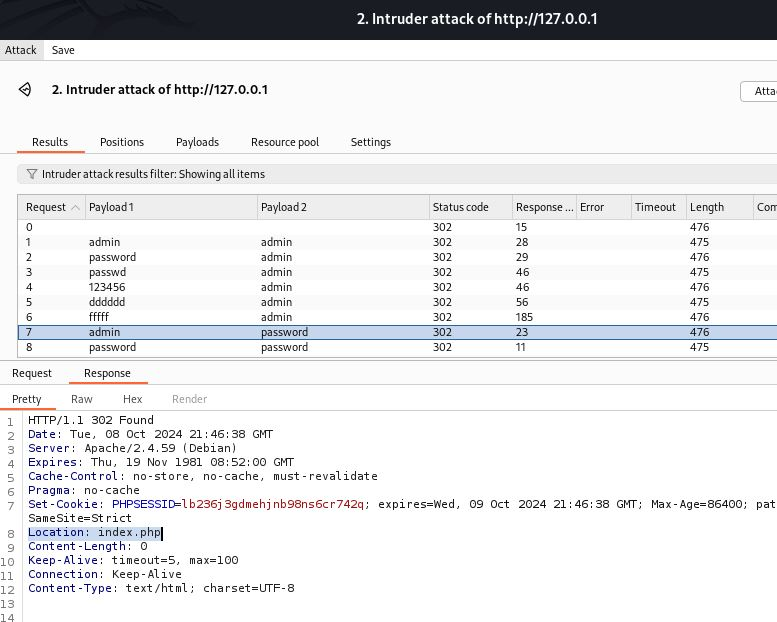{#fig:016 width=70%}

16) Чтобы ещё раз проверить результат мы отправляем эту пару на повторную проверку *Send to Repeater*.
(рис. [-@fig:017])

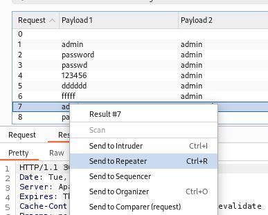{#fig:017 width=70%}

17) Получаем тот же реузльтат *location: index.php*.
(рис. [-@fig:018])

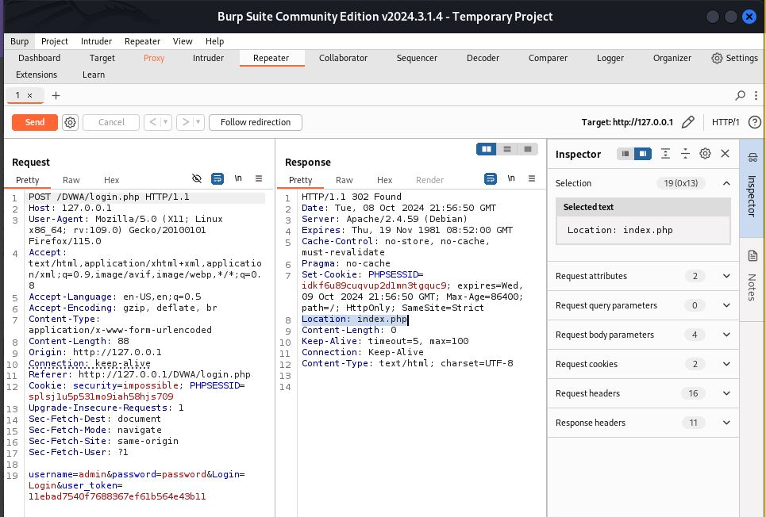{#fig:018 width=70%}

18) Нажимаем на *Follow redirection* и получаем нескомпилированный html код в окне Response.
(рис. [-@fig:019])

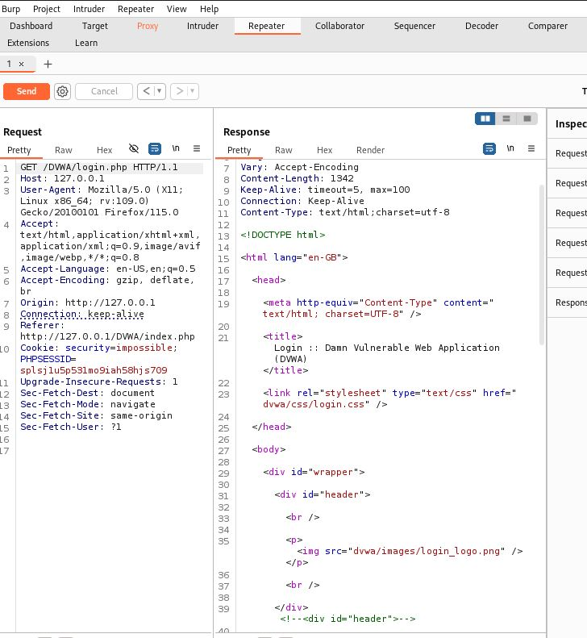{#fig:019 width=70%}

19) В подокне Render получаем вид страницы в браузере.
(рис. [-@fig:020])

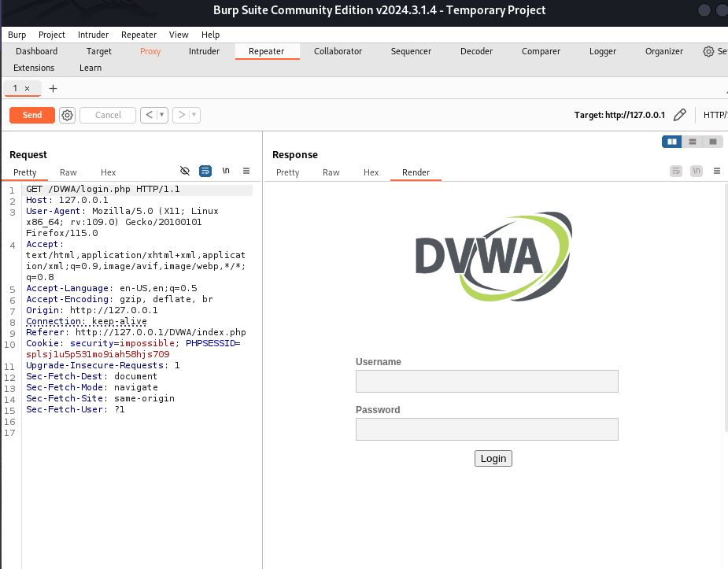{#fig:020 width=70%}

# Вывод

В результате выполнения работы мы научились использовать инструмент Burp Suite и перебором возможных пар подобрали пару логин-пароль для входа на сайт.

# Список литературы{.unnumbered}
1) Парасрам, Ш. Kali Linux: Тестирование на проникновение и безопасность : Для профессионалов. Kali Linux / Ш. Парасрам, А. Замм, Т. Хериянто, и др. – Санкт-Петербург : Питер, 2022. – 448 сс.